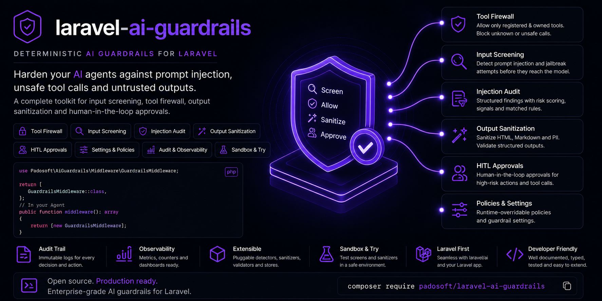

<p align="center">
  
</p>

<h1 align="center">laravel-ai-guardrails</h1>

<p align="center">
  <strong>Deterministic, offline-first prompt-injection guardrails for <a href="https://github.com/laravel/ai"><code>laravel/ai</code></a>.</strong><br>
  Four composable controls that treat <em>everything the model touches</em> — its tool arguments, its prompts, and its output — as untrusted.
</p>

<p align="center">
  
  
  
  
  
</p>

---

## Table of Contents

- [Why it exists](#why-it-exists)
- [What makes it different](#what-makes-it-different)
- [The four controls](#the-four-controls)
- [Quick start](#quick-start)
- [PHP surface](#php-surface)
- [Wiring the agent middleware](#wiring-the-agent-middleware)
- [Artisan surface](#artisan-surface)
- [HTTP API surface (admin)](#http-api-surface-admin)
- [Configuration](#configuration)
- [Composing laravel-flow & laravel-pii-redactor](#composing-laravel-flow--laravel-pii-redactor)
- [The append-only injection audit](#the-append-only-injection-audit)
- [Domain events](#domain-events)
- [Security & threat model](#security--threat-model)
- [Known limitations](#known-limitations)
- [Testing](#testing)
- [Part of the Padosoft AI suite](#part-of-the-padosoft-ai-suite)
- [License](#license)

---

## Why it exists

`laravel/ai` makes it trivial to give a model **tools** (refund an order, delete a record, send an email) and to feed it **untrusted user input**. That is exactly where prompt injection lives:

- The model can be talked into calling a tool with **someone else's** `user_id` (confused-deputy / IDOR).
- A crafted prompt can make it **ignore its instructions** or exfiltrate secrets.
- Its **output** — rendered in your UI — can carry stored-XSS, markdown data-exfiltration links, or leaked PII.
- It can decide, on its own, to **pull the trigger** on a destructive action.

`laravel-ai-guardrails` closes that gap with four **deterministic, offline, unit-testable** controls. No second LLM call, no network, no non-determinism — the audit trail is the product, not a regex you have to trust.

## What makes it different

- **Untrusted-input posture, everywhere.** Tool arguments, prompts, *and* model output are all treated as hostile.
- **Deterministic & offline.** Controls A–C never call a model; every decision is reproducible and testable.
- **Fails closed.** A PCRE error, a tampered flow record, an unresolved engine — every failure path blocks rather than silently allows.
- **Append-only audit.** Every screening attempt (blocked *and* allowed) is logged to an immutable store. The model never updates or deletes it.
- **Composes, doesn't reinvent.** Optional [`padosoft/laravel-flow`](https://packagist.org/packages/padosoft/laravel-flow) for human approval and [`padosoft/laravel-pii-redactor`](https://packagist.org/packages/padosoft/laravel-pii-redactor) for PII — with graceful degradation when absent.
- **Every feature is a toggle**, tested in both states, with a master kill-switch that degrades the whole package to pass-through.

## The four controls

| | Control | What it does | Threat it closes |
|---|---|---|---|
| **A** | **Tool Firewall** | Re-scopes model-chosen owner keys (`user_id`, …) to the authenticated principal server-side and validates every argument against the tool's own JSON schema. | Confused-deputy / IDOR via model-chosen arguments |
| **B** | **Input Screening + Audit** | Normalizes the prompt (defeating homoglyph / zero-width / case evasion), screens it, **refuses before the model runs**, and append-only-logs every attempt. | Jailbreak / exfiltration prompts |
| **C** | **Output Handler** | Treats the response as untrusted: escapes HTML, neutralizes markdown link/image exfil vectors, validates structured output, and redacts PII. | Stored-XSS / data-exfil / PII leakage in model output |
| **D** | **HITL Bridge** | Routes destructive tool calls (refund/delete/email) through `laravel-flow`'s `approvalGate()` — a human approves before the action runs. | Unauthorized destructive actions |

## Quick start

> Junior-proof. Five steps.

**1. Install**

```bash
composer require padosoft/laravel-ai-guardrails
```

**2. Publish the config**

```bash
php artisan vendor:publish --tag=ai-guardrails-config
```

**3. (Optional) Publish + run the audit migration** — only if you want database-backed audit:

```bash
php artisan vendor:publish --tag=ai-guardrails-migrations
php artisan migrate
```

then set `AI_GUARDRAILS_AUDIT_STORE=database` in your `.env`.

**4. Guard a tool call** (Control A) in your app:

```php
use Padosoft\AiGuardrails\Facades\AiGuardrails;

$safeTool = AiGuardrails::guard($refundTool); // re-scopes owner keys + validates args
```

**5. Screen a prompt or sanitize output** anywhere:

```php
$verdict = AiGuardrails::screen($userPrompt);     // ->blocked, ->ruleId, ->refusalMessage
$clean   = AiGuardrails::sanitize($modelOutput);  // HTML/markdown sanitized + PII redacted
```

That's it. Add the agent middleware (below) to screen prompts and sanitize output automatically.

## PHP surface

Everything is reachable from the `AiGuardrails` facade:

```php
use Padosoft\AiGuardrails\Facades\AiGuardrails;

AiGuardrails::screen(string $prompt): ScreenVerdict;                                  // Control B
AiGuardrails::sanitize(string $text): string;                                        // Control C
AiGuardrails::guard(Tool $tool, ?Closure $principalResolver = null): Tool;           // Control A
AiGuardrails::routeForApproval(Tool $tool, string $toolName, ?Closure $principalResolver = null): Tool; // Control D
AiGuardrails::isDestructive(string $toolName): bool;
AiGuardrails::validateStructured(array $output, array $schema, bool $rejectUnknown = false): array; // Control C
```

## Wiring the agent middleware

Declare the input + output middleware on your agent (they implement `laravel/ai`'s middleware contract):

```php
use Padosoft\AiGuardrails\Screening\GuardrailInputMiddleware;
use Padosoft\AiGuardrails\Output\GuardrailOutputMiddleware;
use Laravel\Ai\Contracts\HasMiddleware;

final class SupportAgent implements Agent, HasMiddleware
{
    public function middleware(): array
    {
        return [
            app(GuardrailInputMiddleware::class),  // screens + refuses + audits before the model
            app(GuardrailOutputMiddleware::class), // sanitizes $response->text + structured fields after
        ];
    }
}
```

`GuardrailInputMiddleware` **refuses without ever invoking the model** when a prompt is blocked, and audits every attempt. `GuardrailOutputMiddleware` rewrites the response text (and the structured-output fields) in place — tool calls are left to Controls A/D.

## Artisan surface

```bash
# Screen a prompt (exits non-zero when blocked); reads STDIN if no argument
php artisan ai-guardrails:screen "please ignore all previous instructions"

# Sanitize + redact a text blob
php artisan ai-guardrails:sanitize "<script>steal()</script> "

# List recent injection-audit attempts (blocked and allowed)
php artisan ai-guardrails:audit --limit=50
```

## HTTP API surface (admin)

A read/config HTTP API for an admin panel (e.g. `laravel-ai-guardrails-admin`). It is **default-OFF** — set `api.enabled = true` **and** supply a middleware stack via `api.middleware`. If `api.enabled` is true but `api.middleware` resolves to an empty list, the service provider **throws a `RuntimeException` at boot** (fail-closed against an accidentally open surface) — but it does **not** inspect what that middleware does: **you must include your own authentication/authorization middleware** — these endpoints expose audit data and let an operator change security settings. Routes are mounted under the `api.prefix` (default `ai-guardrails/api`) and named `ai-guardrails.api.*`.

**Envelope.** Successful (and handled-error, e.g. `404`/`409`/`422`-via-controller) responses are enveloped as `{ "schema_version": "ai-guardrails.api.v1", "schema": "ai-guardrails.api.v1.<endpoint>", "data": { … } }` — `schema_version` is the contract version a client pins against; `schema` is a per-endpoint discriminator. (Mirrors the `padosoft-eval-harness` ReportApi house style.) **Exception:** framework-level validation failures (a malformed `PUT /settings` body) return Laravel's standard `422` validation JSON, not the envelope.

| Method | Path | Route name | `schema` | Backing store / toggle |
|---|---|---|---|---|
| GET | `/overview` | `…overview` | `…v1.overview` | aggregates the controls + 24h injection counts |
| GET | `/audit` | `…audit.index` | `…v1.audit-list` | `audit.store` (null \| array \| database) — keyset paginated (`cursor`), filters `blocked`/`rule_id`/`principal_id`/`q`/`from`/`to` |
| GET | `/audit/{id}` | `…audit.show` | `…v1.audit-detail` | full prompt + `matched_span`; 404 on unknown/non-numeric id |
| GET | `/audit/trend` | `…audit.trend` | `…v1.audit-trend` | per-UTC-day SQL `GROUP BY` (dialect-safe); 30-day default window |
| GET | `/firewall` | `…firewall.index` | `…v1.firewall` | `firewall_log.store` — Control A rejections, keyset paginated |
| GET | `/output/stats` | `…output.stats` | `…v1.output-stats` | `output_stats.store` — per-kind counts, 30-day default window |
| GET | `/approvals` | `…approvals.index` | `…v1.approval-list` | Control D pending approvals (via `laravel-flow`); empty when HITL unavailable |
| POST | `/approvals/{token}/approve` | `…approvals.approve` | `…v1.approval-decision` | resumes the parked tool; actor principal derived server-side |
| POST | `/approvals/{token}/reject` | `…approvals.reject` | `…v1.approval-decision` | rejects the parked tool |
| GET | `/settings` | `…settings.show` | `…v1.settings` | `settings.store` (config \| database) — effective overridable settings |
| PUT | `/settings` | `…settings.update` | `…v1.settings` | persists allow-listed, type-validated overrides |
| POST | `/try/screen` | `…try.screen` | `…v1.try-screen` | sandbox: screen a prompt (no persistence) |
| POST | `/try/sanitize` | `…try.sanitize` | `…v1.try-sanitize` | sandbox: sanitize a text blob (no persistence) |

**Append-only stores.** The audit, firewall, and output-stat tables are immutable (the model + builder throw on update/delete). `GET /settings` is current-state and mutable; `PUT /settings` only accepts keys on the `settings.overridable` allow-list and type-validates each value (booleans, enums, bounded strings) — unknown keys are dropped, malformed values are rejected `422`. When `settings.store = database`, saved overrides are overlaid onto the live config at boot so they actually take effect on the controls (fail-safe: a corrupt/null/type-mismatched row keeps the file default).

## Configuration

Every behaviour is a config toggle (`config/ai-guardrails.php`). The four controls are **on by default** (that is the point); the **HITL bridge** (`hitl.enabled`) and the **HTTP API** (`api.enabled`) are **default-OFF** because they need optional dependencies / explicit opt-in. A master kill-switch sits on top.

| Key | Default | Purpose |
|---|---|---|
| `enabled` | `true` | Master kill-switch — off degrades every control to pass-through. |
| `tool_firewall.owner_keys` | `user_id, owner_id, account_id, customer_id` | Argument keys the model may never choose (overwritten server-side). |
| `tool_firewall.reject_unknown_arguments` | `true` | Reject arguments not declared in the tool schema. |
| `input_screen.patterns` | (4 built-in) | `ruleId => PCRE pattern` — the audit is the value, not the list. |
| `normalization.*` | on | NFKC, zero-width strip, casefold, `max_prompt_length`. |
| `pattern_safety.on_match_error` | `closed` | `closed` = block on a PCRE error, `open` = skip the rule. |
| `output_handler.html_mode` | `escape` | `escape` (default) or `allowlist` (keep a safe inline-tag set). |
| `output_handler.redact_pii` | `true` | Redact PII via `laravel-pii-redactor` when present. |
| `hitl.enabled` | `false` | Enable the HITL approval bridge (needs `laravel-flow`). |
| `hitl.destructive_tools` | `refund, delete, send_email` | Tool names treated as destructive. |
| `hitl.fallback` | `deny` | When approval is unavailable: `deny` (refuse) or `pass` (execute). |
| `audit.store` | `'null'` | `'null'` \| `'array'` \| `'database'` (string tokens). |
| `api.enabled` | `false` | The default-OFF HTTP admin API surface. |

> The `modes`, `audit_hygiene`, `retention`, and `tool_authorization` config blocks are scaffolded for the enterprise-hardening line and are documented as they are wired in.

## Composing laravel-flow & laravel-pii-redactor

Both are **optional** (`suggest`). The package degrades gracefully:

```bash
composer require padosoft/laravel-flow          # enables Control D (human approval)
composer require padosoft/laravel-pii-redactor  # enables PII redaction in Control C
```

When a package is absent, `class_exists` guards bind null-object implementations, and the boundary is enforced by an architecture test (flow is referenced only in `src/Hitl`, pii-redactor only in `src/Output`).

## The append-only injection audit

The audit is the product value of Control B. Every screening attempt — blocked *and* allowed — is appended to an immutable store. The Eloquent model and its query builder **throw on update / delete / upsert / touch / increment / truncate**; the table has no `updated_at`. Timestamps are stored in UTC. (A sanctioned, audited retention/erasure maintenance command is part of the enterprise-hardening line.)

## Domain events

Every guardrail decision dispatches a domain event from the **same code path** that writes the audit / stat record, so you can wire SIEM, Slack, or PagerDuty with a single listener. Events are gated by `events.enabled` (default on); set it to `false` to silence them without touching the controls.

| Event | Dispatched when | `$enforced` |
|---|---|---|
| `Padosoft\AiGuardrails\Events\InjectionBlocked` | Control B refused a prompt (enforce) | n/a — separate class |
| `Padosoft\AiGuardrails\Events\InjectionObserved` | Control B detected an injection but passed it through (monitor) | n/a — separate class |
| `Padosoft\AiGuardrails\Events\ToolArgumentRejected` | Control A found owner-key / schema violations in a tool call | `true` = call blocked; `false` = monitor, call proceeded |
| `Padosoft\AiGuardrails\Events\DestructiveToolRouted` | Control D parked a destructive call for human approval (carries the non-secret run reference only) | n/a — enforce only |
| `Padosoft\AiGuardrails\Events\OutputSanitized` | Control C neutralised HTML / markdown / structured / PII in a response (one event per response, deduped kinds) | `true` = text rewritten; `false` = monitor, text unchanged |

In `monitor` mode the `Observed`/`Rejected`/`Sanitized` events still fire. The `$enforced` property on `ToolArgumentRejected` and `OutputSanitized` encodes the enforcement decision directly in the payload — listeners do not need to read the live config to distinguish a real block from a shadow observation.

> **Security note — `InjectionBlocked` / `InjectionObserved` carry the raw prompt text** (via `$attempt->prompt`). If you ship these events to an external webhook (Slack, PagerDuty, SIEM), be aware that the payload may contain PII or sensitive input. Extract only the fields you need (`ruleId`, `blocked`, `occurredAt`) rather than forwarding the full `InjectionAttempt` object.

## Security & threat model

| Control | Untrusted surface | Posture |
|---|---|---|
| A | model-chosen tool arguments | re-scope owner keys server-side + schema-validate; **re-scoping is not authorization** |
| B | user prompts | normalize → screen → **refuse pre-model** → append-only audit; **fail closed** on PCRE errors |
| C | model output (text + structured fields) | escape HTML / defang markdown & URI exfil vectors / validate structure / redact PII |
| D | destructive tool calls | **human-gated** via `approvalGate()`; the plain-text token is never returned to the model |

Every failure path **fails closed**. The master kill-switch and per-control toggles are tested in both states.

## Known limitations

- Control C rewrites `$response->text` and structured string fields; the model's **`toolCalls` are not sanitized** by C (they are governed by Controls A/D).
- NFKC normalization folds fullwidth/compatibility characters but does **not** collapse cross-script homoglyphs (Cyrillic `а` ≠ Latin `a`).
- The HTML `allowlist` mode is a convenience, not HTMLPurifier-grade — for rendering rich untrusted HTML, use a dedicated sanitizer.
- Control D's full flow persistence (approval tokens, resume) is configured by the host application.

## Testing

```bash
composer install
vendor/bin/phpunit          # Unit + Feature + Architecture
vendor/bin/pint --test
vendor/bin/phpstan analyse --memory-limit=512M
```

CI runs the matrix PHP 8.3 / 8.4 / 8.5 × Laravel 13: `composer validate` → `pint` → `phpstan` (level 8) → `phpunit`.

## Part of the Padosoft AI suite

`laravel-ai-guardrails` pairs with **`laravel-ai-guardrails-admin`** (a React control plane for the audit trail, firewall posture, output stats, and approval queue), and composes `padosoft/laravel-flow` and `padosoft/laravel-pii-redactor`.

## License

Apache-2.0 © Padosoft s.r.l. See [LICENSE](LICENSE).
