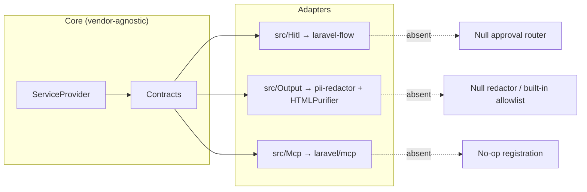

# Compose-not-couple

## The principle

The package **composes** best-in-class libraries rather than reinventing them — `laravel-flow` for human approval, `laravel-pii-redactor` for PII, `HTMLPurifier` for HTML, `laravel/mcp` for the MCP surface. But each is **optional** (`suggest`), and a missing one must never break the package. The discipline: a vendor reference may appear **only** inside its dedicated adapter directory, and everything else degrades to a null object.



## The boundary, enforced by a test

An architecture test scans `src/` and **fails the build** if a vendor namespace escapes its adapter directory:

| Vendor | Allowed only in |
|---|---|
| `Padosoft\LaravelFlow` | `src/Hitl` |
| `Padosoft\PiiRedactor` | `src/Output` |
| `HTMLPurifier` | `src/Output` |
| `Laravel\Mcp` | `src/Mcp` |

The service provider itself references none of them directly — it goes through factories (`ApprovalRouterFactory`, `PiiRedactionFactory`, `HtmlSanitizerFactory`) and registrars (`McpServerRegistrar`) that live inside the adapter dirs.

## Graceful degradation

Each integration is guarded by `class_exists` and bound to a null object when absent:

```php
// PiiRedactionFactory — the vendor ref stays inside src/Output
return class_exists(RedactorEngine::class) && $redactPii
    ? new RealPiiRedaction($app->make(RedactorEngine::class))
    : new NullPiiRedaction;
```

::: callout tip
`use Vendor\Class;` at the top of an adapter file is **safe** — PHP only autoloads a class when it is instantiated or reflected, and every instantiation is `class_exists`-guarded. The architecture test strips comments before scanning, so a vendor mention in a docblock is not a false positive.
:::

## Why a test, not a convention

Conventions rot. A test makes the boundary a build-time invariant: you cannot accidentally `new HTMLPurifier()` in a controller, because the next CI run fails. This is the same philosophy as the [append-only stores](/guides/retention) and the [mutation-testing gate](/operations/observability) — encode the invariant, don't hope for it.
