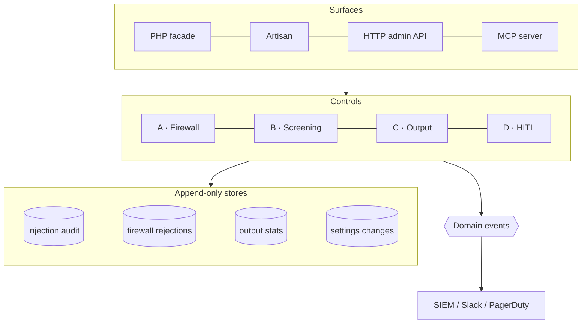

# Architecture overview

## Layers

The package is organised as four **deterministic controls**, a set of **append-only stores**, a **domain-event** layer, and three (optionally four) **surfaces** that expose it.

## The facade is the single entry point

`AiGuardrails` composes the controls: `screen()` and `sanitize()` are deterministic; `guard()` wraps a tool with the firewall (and the authorization gate when enabled); `routeForApproval()` wraps a destructive tool with the HITL bridge; `validateStructured()` validates structured output. The master kill-switch makes every wrapper a no-op.

## Tri-surface discipline

Every capability is reachable from **PHP + Artisan + HTTP API**, with **MCP** as an optional fourth surface. The HTTP API is default-OFF behind `api.enabled`, returns a `{schema_version, schema, data}` envelope, and uses route names `ai-guardrails.api.*`. See [the HTTP admin API](/operations/http-api) and [the MCP surface](/guides/mcp).

## Append-only by construction

Audit-style stores never UPDATE or DELETE in place — the Eloquent models throw on mutation. The only sanctioned erasure path is the actor-audited [`ai-guardrails:purge`](/guides/retention) command.

## Boot wiring

At register/boot the provider resolves each control's [mode](/concepts/modes), binds the right store implementation (null \| array \| database), wires the optional vendors through adapter factories, overlays any persisted runtime settings onto config, and — when enabled — mounts the HTTP routes and the MCP server. Read the full sequence in the [request pipeline](/architecture/pipeline) and the [compose-not-couple](/architecture/compose-not-couple) boundary.

## Where the decisions live

The non-obvious choices — append-only vs GDPR, monitor mode, fail-closed config, the adapter boundary — are recorded as [Architecture Decision Records](/architecture/decisions).
