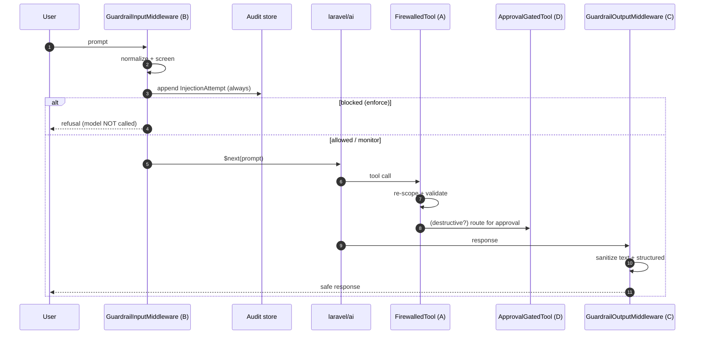

# Request pipeline

## One agent turn, end to end

A single agent turn touches Control B on the way in, then Controls A/D/C on the way out. The middleware runs through `laravel/ai`'s pipeline; tool decorators run when the model invokes a tool.

## Inbound: Control B

The input middleware **screens before** calling the model. On an enforced block it returns a fabricated refusal and never invokes `$next` — zero token cost. Every attempt (blocked, observed, allowed) is appended to the audit store *and* dispatched as a [domain event](/guides/events) from the same code path, so persistence and observability never diverge.

## Tool time: Controls A & D

When the model calls a tool, the `FirewalledTool` decorator re-scopes owner keys and validates arguments (Control A). If the tool is destructive, the `ApprovalGatedTool` decorator parks it for human approval (Control D) instead of executing. Both are applied by the facade's `guard()` / `routeForApproval()`.

## Outbound: Control C

The output middleware rewrites `$response->text` and structured string leaves — sanitize HTML/markdown then redact PII — counting each neutralisation and dispatching `OutputSanitized`.

## Settings overlay (boot)

If `settings.store=database`, the provider overlays persisted runtime overrides onto `config('ai-guardrails.*')` at the **start** of `register()`, before the controls wire — so what the admin saved via `PUT /settings` is what the controls actually enforce, not just what the API reports. It fails safe: a corrupt or type-mismatched row keeps the file default.

::: callout info
The middleware dispatches the domain event **before** the audit append, so a database outage can still emit the SIEM signal — observability is independent of persistence.
:::
