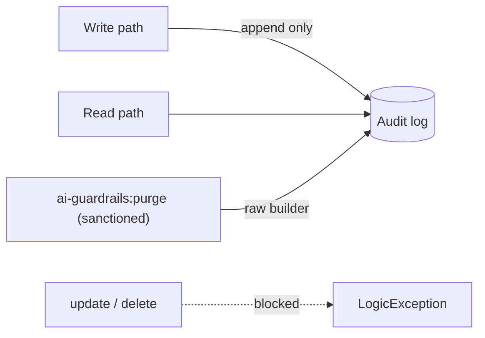

# Append-only audit

## Motivation

The value of Control B is not the pattern list — it is the **forensic record** of every screening attempt. A record you can edit or delete on a whim is not forensic evidence: an attacker (or a careless operator) who can mutate the log can erase their own tracks. So the audit is **append-only by construction** — rows can be inserted and read, never updated or deleted in place.

## The invariant

Let $L$ be the audit log and $R$ a row. The store guarantees:

$$
\forall R \in L:\ \text{insert}(R) \text{ permitted},\quad \text{update}(R)=\text{delete}(R)=\bot
$$

The Eloquent model and its query builder **throw** on `update`, `delete`, `upsert`, `truncate`, `increment`, and mass-mutation — there is no in-place mutation path through the ORM. The table carries no `updated_at`. The same invariant holds for the firewall-rejection, output-stat, and settings-change logs.

## Reconciling with GDPR

An immutable log and the "right to erasure" appear contradictory. They are reconciled by a **single sanctioned exit**: the actor-audited `ai-guardrails:purge` command, which uses the **raw query builder** to bypass the immutable model — so the append-only invariant stays true for *every other* code path, while erasure happens through one auditable, accountable channel. See [audit hygiene & retention](/guides/retention).

| Concern | Mechanism |
|---|---|
| Tamper-evidence | model throws on update/delete; no `updated_at` |
| Keep PII out | `audit_hygiene.prompt_storage` (redact/hash/truncate) on write |
| Right to erasure | `ai-guardrails:purge` (anonymize/purge), actor-logged, the only mutation path |

## Why a thrown exception, not a database trigger

Enforcing immutability in application code (the model throws) keeps the guarantee portable across every database driver and visible in the stack trace, rather than hidden in a DB-specific trigger. It is the same philosophy as the [compose-not-couple architecture test](/architecture/compose-not-couple): encode the invariant where the code can see it fail.

::: callout warning
The append-only guarantee is at the **ORM** layer. A privileged operator with raw SQL access can still mutate the table — immutability defends against application-level tampering and accidental deletes, not a compromised DBA. Pair it with database-level audit controls for a complete posture.
:::
