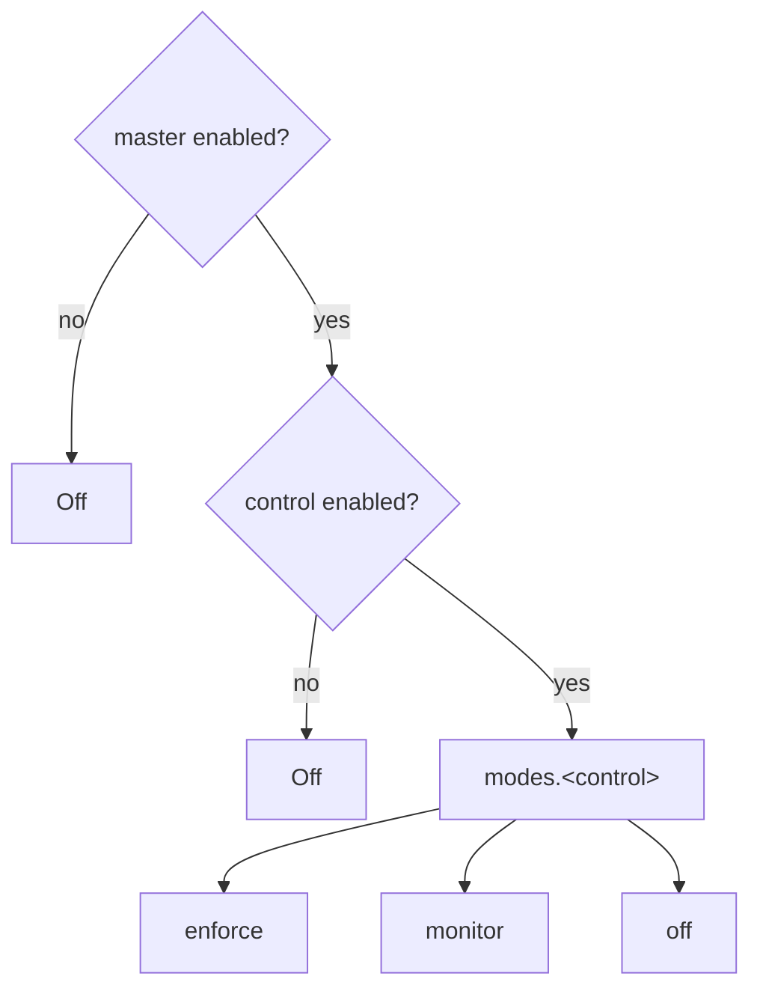

# Enforce / monitor / off modes

## Motivation

Turning a guardrail to "block" on day one is risky: you don't yet know its false-positive rate against *your* traffic. The **monitor** mode lets you deploy a control in observation — it detects, audits, and emits events exactly as if enforcing, but it does **not** block. You watch the would-have-blocked stream, tune, and only then flip to `enforce`.

## The three modes

| Mode | Detects? | Audits/emits? | Blocks? |
|---|---|---|---|
| `enforce` | yes | yes | **yes** |
| `monitor` | yes | yes | no (shadow) |
| `off` | no | no | no (pass-through) |

Each of the four controls has its own dial under `modes.*` (`tool_firewall`, `input_screen`, `output_handler`, `hitl`), default `enforce`.

## Resolution gate

The effective mode is resolved by a fixed gate order — the master switch and the per-control `enabled` flag both win over the mode:



Formally, with master $K$, per-control enabled $e$, and configured mode $m$:

$$
\text{mode} = \begin{cases} \text{off} & \neg K \ \lor\ \neg e \\ m & \text{otherwise (default enforce)} \end{cases}
$$

`enabled` decides **whether** a control runs; the per-control `modes` entry decides **how** (block vs observe).

## What monitor does per control

::: collapsible "Control A (firewall)"
Re-scopes owner keys and records the `FirewallRejection` + `ToolArgumentRejected` event, but **does not throw** — the (re-scoped) call proceeds. Schema-violating args reach the delegate, so only use monitor when the tool ignores unknown args.
:::

::: collapsible "Control B (input screening)"
Audits the detection with `blocked=false` (keeping the rule id) and dispatches `InjectionObserved`, then **reaches the model**.
:::

::: collapsible "Control C (output handler)"
Records the same would-sanitize stats and dispatches `OutputSanitized` with `$enforced=false`, but returns the **original** text unchanged.
:::

::: collapsible "Control D (HITL)"
Runs the destructive call **directly** with an observability log entry — monitor is shadow, not protection, for Control D.
:::

## Worked example

```dotenv
# Shadow-roll input screening, keep the firewall enforcing:
AI_GUARDRAILS_MODE_INPUT_SCREEN=monitor
AI_GUARDRAILS_MODE_TOOL_FIREWALL=enforce
```

The [overview API](/operations/http-api) surfaces each control's resolved `mode`, so an operator dashboard can show shadow vs live posture at a glance.

## Gotchas

::: callout warning
- **`monitor` is not "safe mode" for Control D** — destructive calls execute. Keep HITL on `enforce` in production.
- The `$enforced` flag on `ToolArgumentRejected` / `OutputSanitized` events encodes the decision in the payload, so SIEM listeners distinguish a real block from a shadow observation without reading live config.
:::
