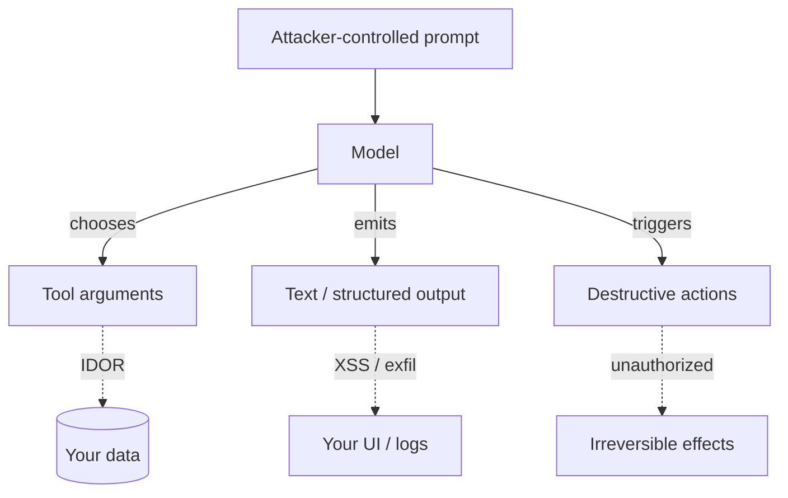

# Threat model

## The shift agents introduce

A classic web app trusts its own code and treats *requests* as untrusted. An AI agent adds a new, stranger actor inside the trust boundary: a **model** that takes untrusted input and emits both text *and actions*. The model is not malicious — but it is **steerable** by whoever controls its input. That makes three new surfaces hostile.

## Assets

- **Other users' data** — reachable via confused-deputy tool calls.
- **Your UI and downstream systems** — where untrusted output is rendered, parsed, logged.
- **Irreversible side effects** — refunds, deletions, outbound messages.
- **The audit trail itself** — forensic evidence that must survive tampering and erasure pressure.

## Adversary capabilities (assumed)

- Full control of the prompt text, including Unicode tricks (homoglyphs, zero-width, case), and the ability to iterate.
- Ability to steer tool-argument selection and output content.
- **No** ability to execute code in your app or write to your database directly. (If they can, this package is not your problem.)

## Postures (and which control enforces them)

| Surface | Posture | Control |
|---|---|---|
| Tool arguments | re-scope owner keys + schema-validate; reject unknown | [A](/controls/tool-firewall) |
| Prompts | normalize → screen → refuse pre-model → append-only audit | [B](/controls/input-screening) |
| Output | escape/allowlist HTML, defang markdown, validate structure, redact PII | [C](/controls/output-handler) |
| Destructive actions | human-gated approval, fail-closed | [D](/controls/hitl-bridge) |

## Fail-safe principle

Every failure path **fails closed**: a PCRE error blocks, an unavailable approval system denies, a missing config value resolves to the *safer* state. The reasoning is in [untrusted-input posture](/concepts/untrusted-input).

::: callout warning
This package defends the **deterministic, server-side** boundary. It does **not** make the model itself robust, and it cannot stop an attack that lives entirely in semantics the patterns don't capture — which is exactly why the **append-only audit** matters: even an undetected attempt is recorded for forensics.
:::
