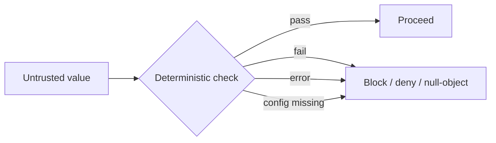

# Untrusted-input posture

## The rule

> Treat **everything the model touches** — its tool arguments, its prompts, and its output — as attacker-controlled until a deterministic check says otherwise.

This is the single idea the whole package is built on. It is deliberately paranoid, because the cost of a false "trusted" is an IDOR, a stored XSS, or an unauthorized refund, while the cost of a false "untrusted" is a re-scoped argument or an escaped `<`.

## Three corollaries

::: steps

1. **Model-chosen tool arguments are untrusted.**

   Re-scope owner keys server-side (recursively), validate against the tool schema, reject unknown args. Re-scoping is *not* authorization — gate tool use separately.

2. **Prompts are untrusted.**

   Normalize (NFKC, strip zero-width/control, fold confusables, casefold) **before** matching to defeat homoglyph / zero-width / case evasion; bound length; use `/u`-flagged PCRE.

3. **Model output is untrusted.**

   Escape HTML / neutralize markdown link+image+autolink + `javascript:`/`data:` URI exfil vectors; validate structured fields; compose PII redaction.

:::

## Fail closed, always

A security component must never *silently* allow on error. Concretely:

- **Regex errors block.** On a `preg_match` error the rule is treated as a match (blocked) and logged — never skipped silently. The `pcre.backtrack_limit` is bounded and restored with `try/finally`.
- **Missing config resolves to the safe state.** Laravel's package config merge does *not* recursively restore nested defaults, so a partial host config can leave a nested key `null`. The package treats missing/non-array as the **unsafe** state and fails closed (e.g. an open API surface throws at boot).
- **Unavailable dependencies degrade safely.** No `laravel-flow` → destructive actions deny (default). No PII redactor → a null-object passthrough, not a crash.

## Why deterministic, not a second model

A second LLM "judge" is itself steerable, non-deterministic, costs a round-trip, and cannot be unit-tested. Controls A–C are pure functions over normalized input: same input, same verdict, every time, offline. That is auditable in a way a model judge never is.

::: callout tip
The corollary you'll feel most often: **write screening patterns in lowercase or with `/i`** — they match the *casefolded, normalized* form, not the raw prompt.
:::
