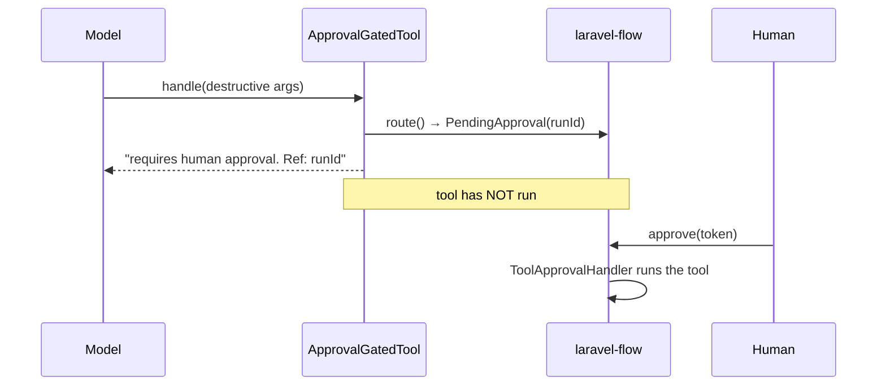

# Control D — HITL Bridge

## Motivation

Some tools are irreversible: `refund`, `delete_account`, `send_email`. No amount of argument validation makes "the model decided to wire the money" acceptable without a human in the loop. Control D intercepts **destructive** tool calls and parks them for human approval instead of executing them — the real action happens later, only when a person approves.

## Theory

A tool is *destructive* if its name matches the configured set under a match policy:

$$
\text{destructive}(t) = \begin{cases} t \in D & \text{exact} \\ \exists\, d \in D : d \subseteq t & \text{substring} \end{cases}
$$

where $D = $ `hitl.destructive_tools`. A destructive call is **routed** (not run): the bridge issues a `PendingApproval` through `laravel-flow`'s `approvalGate()` and returns a *non-secret run reference* to the model — never the approval token. On approval, a flow step runs the tool with the original arguments and the recorded principal.

## Design



## Data model

| Concept | Shape |
|---|---|
| Destructive set | `hitl.destructive_tools` — `['refund','delete','send_email']` |
| Match policy | `tool_authorization.destructive_match` — `exact` \| `substring` |
| Unavailable fallback | `hitl.fallback` — `deny` (refuse) \| `pass` (execute) |
| Execution allowlist | `hitl.allowed_tool_classes` — FQCNs the handler may run (empty = no restriction) |
| HITL request sidecar | `hitl_requests.store` — `null` \| `array` \| `database`; records `tool`, `arguments`, `principal_id`, `occurred_at` at park-time |

### HITL request sidecar and raw arguments

At park-time, `ApprovalGatedTool` writes one row to the **append-only HITL request sidecar** (`ai_guardrails_hitl_requests`). The sidecar stores the **scoped** arguments (after Control A has re-written owner keys and stripped unknown fields) so that `GET /approvals` can surface them to a human approver.

**Raw arguments are stored by design.** An approver must see exactly what will execute when they click "Approve" — presenting anything other than the literal execution arguments would undermine the human-in-the-loop guarantee. The sidecar is append-only (the model throws on update/delete) and is covered by the `ai-guardrails:purge` command for GDPR erasure — see [audit hygiene & retention](/guides/retention).

Enable the sidecar via `hitl_requests.store=database` (default: `null`, off). When no sidecar row exists for a `run_id`, `GET /approvals` degrades gracefully to `tool: ""` and `arguments: {}`.

## Decision records

::: collapsible "ADR-D1 · Never return the approval token to the model"
**Problem.** The model needs *something* to relay to the user, but the approval token is a credential.

**Decision.** Return only the **non-secret `runId`**; the plain-text token never leaves the flow/DB layer.

**Consequences.** A conversation log or a model that relays its response cannot leak the approval credential.
:::

::: collapsible "ADR-D2 · Fail-closed when approval is unavailable"
**Problem.** What if `laravel-flow` is absent or routing throws?

**Decision.** Default `hitl.fallback=deny` — refuse the destructive action. Any router exception is caught and also denies. `pass` is available for non-critical setups.

**Consequences.** A misconfigured approval system blocks destructive actions rather than letting them through.
:::

::: collapsible "ADR-D3 · Post-approval execution is allowlisted"
**Problem.** If the flow DB row (which stores `tool_class`) is writable by an attacker, arbitrary tool invocation becomes possible.

**Decision.** `hitl.allowed_tool_classes` restricts which FQCNs `ToolApprovalHandler` may execute (empty = unrestricted; recommended: enumerate the destructive classes).

**Consequences.** Limits blast radius if the persistence layer is compromised.
:::

## Worked example

```php
use Padosoft\AiGuardrails\Facades\AiGuardrails;

$gated = AiGuardrails::routeForApproval($refundTool, 'refund');
$result = (string) $gated->handle(new Request(['order_id' => 'A1']));
// → "This destructive action [refund] requires human approval. Reference: run-77 …"
// the tool has NOT executed.
```

Setting it up is turnkey — see the [HITL guide](/guides/hitl) and the `ai-guardrails:hitl-install` / `ai-guardrails:hitl-status` commands.

## Gotchas

::: callout warning
- **Control D needs `laravel-flow` installed and migrated.** Run `ai-guardrails:hitl-install`, then verify with `ai-guardrails:hitl-status` (non-zero exit until HITL can actually gate a call).
- **In `monitor` mode the destructive call runs directly** (with an observability log) — monitor is for shadow rollout, not protection.
- **Flow persistence (tokens, resume) is the host's setup.** The package provides the bridge; the host owns the database/flow configuration.
:::
