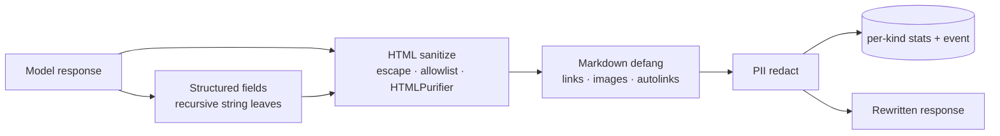

# Control C — Output Handler

## Motivation

Model output is rendered in *your* UI, logged in *your* systems, and parsed by *your* code. An attacker who controls the prompt can steer the output to carry **stored XSS** (for example a script tag), **markdown data-exfiltration** (`` makes the victim's client fetch an attacker URL), or **leaked PII**. None of that is the model's fault to fix — the output is untrusted, full stop.

## Theory

Control C rewrites `$response->text` (and structured string leaves) through a composition:

$$
\text{clean}(t) = \text{redact}_{\text{PII}}\big(\text{defang}_{\text{md}}(\text{sanitize}_{\text{html}}(t))\big)
$$

- **HTML.** `escape` mode `htmlspecialchars`-escapes everything; `allowlist` mode keeps a tiny safe inline-tag set, dropping all attributes — backed by **HTMLPurifier** when installed for robust parsing of malformed / entity-encoded / mutation-XSS markup.
- **Markdown.** Inline links/images, reference-link definitions, and angle autolinks (including bare-colon `javascript:` / `data:` schemes) are neutralized — the exfiltration *target* is removed while visible text is kept.
- **PII.** Composed from `laravel-pii-redactor` when present (null-object otherwise).

Each neutralisation is counted per-kind and dispatched as an [`OutputSanitized`](/reference/events) event.

## Design



## Data model

| Kind (`OutputStatKind`) | Trigger |
|---|---|
| `html_stripped` | a tag-like fragment was escaped/stripped |
| `markdown_sanitized` | a link/image/autolink was defanged |
| `structured_validation_failure` | `validateStructured()` found a violation |
| `pii_redaction` | the PII redactor changed the text |

`pii_redaction` rows are optionally tagged with a **detector name** (e.g. `"email"`, `"phone"`, `"ssn"`) when `laravel-pii-redactor` supplies one. `GET /output/stats` surfaces this as `counts.pii.by_detector` — a map from detector name to count. When no detector tag is present (legacy rows or unknown detector), the row is counted in `pii_redaction` but not in `by_detector`.

Config lives under `output_handler`: `sanitize_html`, `neutralize_markdown`, `html_mode` (`escape` \| `allowlist`), `redact_pii`, and the opt-in `sanitize_tool_calls`.

## Decision records

::: collapsible "ADR-C1 · tool_calls are not sanitized by default"
**Problem.** Should Control C also rewrite the model's tool-call arguments?

**Decision.** No — by default. Tool calls are *executed* and governed by Controls A/D; blindly rewriting their arguments could corrupt a legitimate call. An **opt-in** `output_handler.sanitize_tool_calls` (default off) adds a defense-in-depth pass over their string leaves for hosts that render/log those arguments.

**Consequences.** Safe default (no tool ever altered); opt-in for the render/log case.
:::

::: collapsible "ADR-C2 · allowlist composes HTMLPurifier, with graceful fallback"
**Problem.** The built-in `strip_tags` allowlist is convenience-grade, not a real HTML sanitizer.

**Decision.** When `html_mode=allowlist` and `ezyang/htmlpurifier` is installed, use HTMLPurifier (parses the document, strips every attribute, removes links); fall back to the built-in allowlist when absent. `escape` mode is unchanged.

**Consequences.** Robust sanitization when the dependency is present; zero hard dependency.
:::

::: collapsible "ADR-C3 · monitor records, does not rewrite"
**Problem.** How does shadow-rollout interact with output rewriting?

**Decision.** In `monitor` mode Control C records the same would-sanitize stats and dispatches the event with `$enforced=false`, but returns the **original** text unchanged.

**Consequences.** Operators see exactly what enforcement *would* neutralise before flipping to enforce.
:::

## Worked example

```php
use Padosoft\AiGuardrails\Facades\AiGuardrails;

AiGuardrails::sanitize('<script>steal()</script> ');
// → "&lt;script&gt;steal()&lt;/script&gt; "

// Structured validation (Control C):
$schema = ['action' => (new JsonSchemaTypeFactory)->string()->required()];
AiGuardrails::validateStructured(['action' => 123], $schema); // ['action' => 'must be of type [string].']
```

## Gotchas

::: callout warning
- **`$response->text` is mutated in place** — Control C rewrites text and structured string fields, not `toolCalls` (unless you opt in). Tool calls are governed by Controls A/D.
- **NFKC ≠ HTML-safety.** The HTML allowlist is for *rendering* untrusted markup; for full rich-HTML rendering use a dedicated sanitizer — `allowlist` keeps only a minimal inline-tag set.
:::
