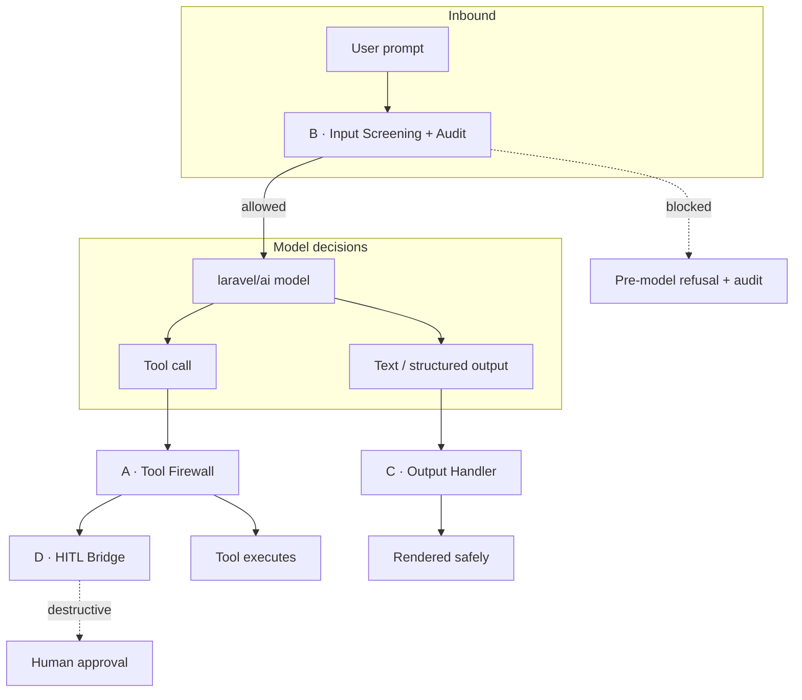

# The four controls

An AI agent has exactly three things an attacker can reach: the **arguments** it passes to tools, the **prompt** it is fed, and the **output** it produces. Each is untrusted. `laravel-ai-guardrails` places one deterministic control on each surface, plus a human gate on the most dangerous action class.

## The mapping

| | Control | Untrusted surface | Threat it closes |
|---|---|---|---|
| **A** | [Tool Firewall](/controls/tool-firewall) | model-chosen tool arguments | confused-deputy / IDOR |
| **B** | [Input Screening + Audit](/controls/input-screening) | user prompts | jailbreak / exfiltration prompts |
| **C** | [Output Handler](/controls/output-handler) | model output (text + structured) | stored-XSS / data-exfil / PII leakage |
| **D** | [HITL Bridge](/controls/hitl-bridge) | destructive tool calls | unauthorized destructive actions |

## Composability

The controls are independent and individually toggleable. A master kill-switch (`ai-guardrails.enabled`) degrades the whole package to pass-through; each control also has its own `enabled` flag and an [enforce / monitor / off mode](/concepts/modes). Nothing shares state — you can adopt Control B alone, or all four.

::: callout info
Controls **A, B, C are deterministic and offline** — no model call, no network. Only Control D reaches out (to `laravel-flow` for human approval). That is what makes the whole stack reproducible and unit-testable.
:::

## The audit *is* the product

Control B appends **every** screening attempt — blocked *and* allowed — to an immutable store. The list of patterns you can argue about; the append-only forensic record you cannot. That record is the value proposition, surfaced through the [HTTP admin API](/operations/http-api) and [domain events](/guides/events).

## Where to go next

- Each control page below explains its **theory, data model, decision records, and a worked example**.
- The [threat model](/concepts/threat-model) frames *why* each posture is chosen.
- The [architecture overview](/architecture/overview) shows how the pieces wire together at boot.
