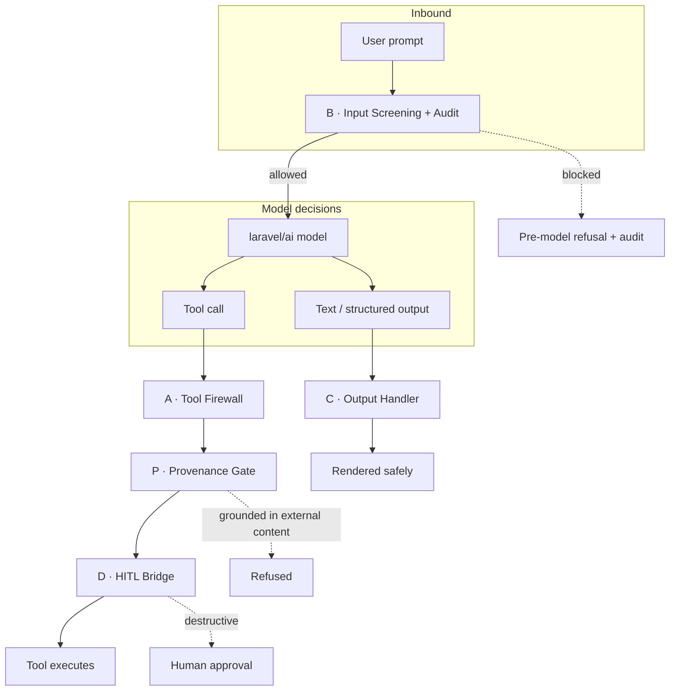

# The five controls

An AI agent has three surfaces an attacker reaches *directly*: the **arguments** it passes to tools, the **prompt** it is fed, and the **output** it produces. Each is untrusted. `laravel-ai-guardrails` places one deterministic control on each, plus a human gate on the most dangerous action class.

There is a fourth surface, and it is the one that has aged worst: **the material the model reads**. Retrieval-augmented agents ground answers in a corpus, and any corpus that ingests email, tickets, or scraped pages is a corpus an outsider can write into. Control P covers that surface — not by inspecting the text, but by knowing where it came from.

```mermaid
flowchart TB
    subgraph Inbound
      P[User prompt] --> B[B · Input Screening + Audit]
    end
    B -->|allowed| LLM[laravel/ai model]
    B -.->|blocked| Refuse[Pre-model refusal + audit]
    subgraph Model decisions
      LLM --> TC[Tool call]
      LLM --> Txt[Text / structured output]
    end
    TC --> A[A · Tool Firewall]
    A --> P2[P · Provenance Gate]
    P2 --> D[D · HITL Bridge]
    Txt --> C[C · Output Handler]
    D --> Run[Tool executes]
    P2 -.->|grounded in external content| Refuse2[Refused]
    D -.->|destructive| Approve[Human approval]
    C --> UI[Rendered safely]
```

## The mapping

| | Control | Untrusted surface | Threat it closes |
|---|---|---|---|
| **A** | [Tool Firewall](/controls/tool-firewall) | model-chosen tool arguments | confused-deputy / IDOR |
| **B** | [Input Screening + Audit](/controls/input-screening) | user prompts | jailbreak / exfiltration prompts |
| **C** | [Output Handler](/controls/output-handler) | model output (text + structured) | stored-XSS / data-exfil / PII leakage |
| **D** | [HITL Bridge](/controls/hitl-bridge) | destructive tool calls | unauthorized destructive actions |
| **P** | [Provenance Gate](/controls/provenance-gate) | the grounding the model read | indirect prompt injection via retrieved content |

## Composability

The controls are independent and individually toggleable. A master kill-switch (`ai-guardrails.enabled`) degrades the whole package to pass-through; each control also has its own `enabled` flag and an [enforce / monitor / off mode](/concepts/modes). Nothing shares state — you can adopt Control B alone, or all five.

::: callout info
Controls **A, B, C and P are deterministic and offline** — no model call, no network. P reads a fact the host already recorded; it does not analyse text. Only Control D reaches out (to `laravel-flow` for human approval). That is what makes the whole stack reproducible and unit-testable.
:::

## The audit *is* the product

Control B appends **every** screening attempt — blocked *and* allowed — to an immutable store. The list of patterns you can argue about; the append-only forensic record you cannot. That record is the value proposition, surfaced through the [HTTP admin API](/operations/http-api) and [domain events](/guides/events).

## Where to go next

- Each control page below explains its **theory, data model, decision records, and a worked example**.
- The [threat model](/concepts/threat-model) frames *why* each posture is chosen.
- The [architecture overview](/architecture/overview) shows how the pieces wire together at boot.
