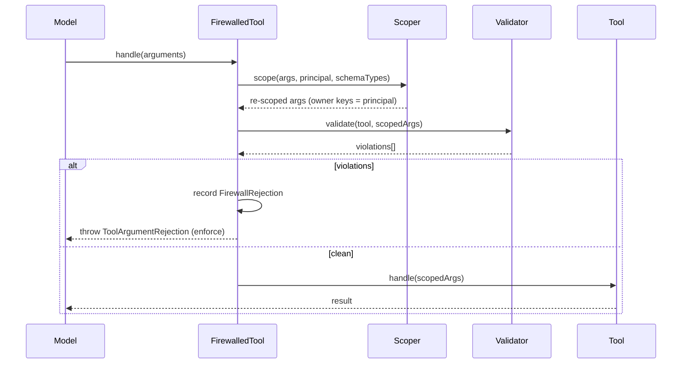

# Control A — Tool Firewall

## Motivation

When you give a model a tool — `refund(order_id, user_id)` — the model chooses the arguments. A crafted prompt can make it call the tool with **someone else's** `user_id`. The application, trusting its own tool, executes against the wrong account. This is the **confused-deputy** problem, and at the data layer it is an **IDOR** (insecure direct object reference).

The fix is not to trust the model's choice of *owner* arguments at all: overwrite them server-side with the authenticated principal, and reject anything the tool's schema does not declare.

## Theory

Let a tool declare a schema $S$ — a set of property names with JSON-schema types — and a subset $O \subseteq S$ of **owner keys** (e.g. `user_id`, `account_id`). Let $p$ be the authenticated principal. For model-chosen arguments $A$, the firewall computes:

$$
A' = \big(A \setminus O\big)\ \cup\ \{\, k \mapsto p \mid k \in O \cap S \,\}
$$

then **validates** $A'$ against $S$: every required key present, every value type-correct, and (optionally) every key in $A'$ declared in $S$. Re-scoping is **not** authorization — it only guarantees the principal acts on *their own* resources; whether the principal may use the tool at all is [Control A+ tool authorization](/guides/tools).

## Design



## Data model

| Concept | Shape |
|---|---|
| Owner keys | `tool_firewall.owner_keys` — `['user_id','owner_id','account_id','customer_id']` |
| Scoping depth | `tool_authorization.owner_key_depth` — `recursive` (default) or `top_level` |
| Unknown args | `tool_firewall.reject_unknown_arguments` — `true` rejects keys not in the schema |
| Rejection record | `FirewallRejection{ toolDescription, principalId, violations, occurredAt }` |

Owner-key re-scoping is **schema-aware**: only keys the tool actually declares are injected, and the principal is coerced to the declared type (an `integer` owner field gets an int, a UUID stays a string).

## Decision records

::: collapsible "ADR-A1 · Re-scope, don't reject, owner keys"
**Problem.** A model that supplies a foreign `user_id` could be hard-rejected — but legitimate calls often omit the owner key entirely.

**Decision.** Always **overwrite** owner keys with the principal (inject them even when absent), rather than reject on mismatch. Rejection is reserved for *schema* violations.

**Consequences.** The model can never influence ownership; a tool that genuinely needs a different user (admin cross-user actions) must not list that field as an owner key.
:::

::: collapsible "ADR-A2 · owner_key_depth defaults to recursive"
**Problem.** Owner keys can hide inside nested argument objects, evading a top-level-only rewrite.

**Decision.** Default to `recursive` — overwrite owner keys at **any** nesting depth (overwrite-only; never inject into nested objects).

**Consequences.** An IDOR-prevention firewall closes nested holes by default. Recursive folding can only *overwrite a model-supplied owner key*, so it can never weaken a legitimate tool. Opt out with `top_level` if your tools legitimately carry nested same-named fields.
:::

## Worked example

```php
use Padosoft\AiGuardrails\Facades\AiGuardrails;

$safe = AiGuardrails::guard($refundTool);

// Model tries to refund on behalf of user 999 — but the request is authenticated as 42.
$safe->handle(new Request(['order_id' => 'A1', 'user_id' => '999']));
// → tool runs with user_id = '42' (the principal); the model's 999 is overwritten.

// Model adds an undeclared argument:
$safe->handle(new Request(['order_id' => 'A1', 'evil' => 'x']));
// → throws ToolArgumentRejection — 'evil' is not in the tool schema.
```

In `monitor` mode the firewall still re-scopes owner keys and records the rejection, but does **not** throw — useful for a shadow rollout.

## Gotchas

::: callout warning
- **Re-scoping is not authorization.** It prevents acting on *another* user's resource; it does **not** decide whether the principal may use the tool. Add the [tool authorization gate](/guides/tools) for that.
- **Null principal + owner key present = refusal.** An unauthenticated request that carries an owner key is rejected (fail-closed) — don't run firewalled tools before authentication.
- **In `monitor` mode, schema-violating args reach the delegate.** Only use monitor when the downstream tool ignores unrecognised arguments.
:::
