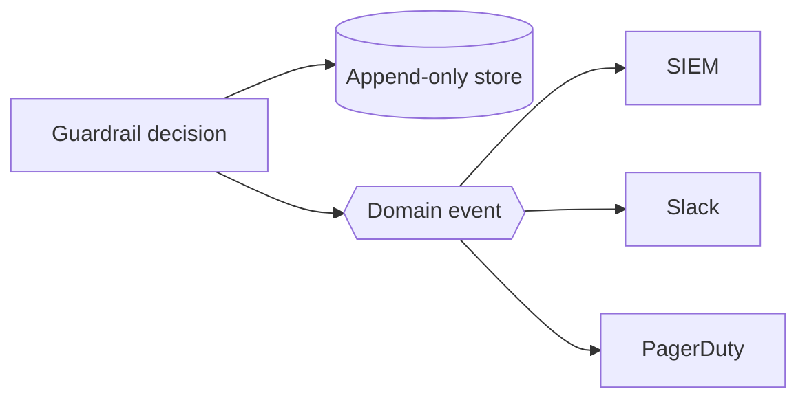

# Domain events → SIEM / Slack

Every guardrail decision dispatches a domain event from the **same code path** that writes the audit/stat record, so you can wire SIEM, Slack, or PagerDuty off a single source of truth. Events are gated by `events.enabled` (default on).

## The events

| Event | Fires when |
|---|---|
| `InjectionBlocked` | Control B refused a prompt (enforce) |
| `InjectionObserved` | Control B detected an injection but passed it (monitor) |
| `ToolArgumentRejected` | Control A found owner-key / schema violations (`$enforced` flags enforce vs monitor) |
| `DestructiveToolRouted` | Control D parked a destructive call (carries the non-secret run reference only) |
| `OutputSanitized` | Control C neutralised HTML/markdown/structured/PII (`$enforced`, deduped kinds) |
| `SettingsChanged` | a security setting was mutated via `PUT /settings` |

Full payload shapes are in the [events reference](/reference/events).

## Listen

```php
use Illuminate\Support\Facades\Event;
use Padosoft\AiGuardrails\Events\InjectionBlocked;

Event::listen(InjectionBlocked::class, function (InjectionBlocked $e) {
    Slack::alert("Injection blocked: rule {$e->attempt->ruleId}");
});
```



## Monitor-aware payloads

In `monitor` mode the `Observed` / `Rejected` / `Sanitized` events still fire. The `$enforced` boolean on `ToolArgumentRejected` and `OutputSanitized` encodes the enforcement decision **in the payload**, so a listener distinguishes a real block from a shadow observation without reading live config.

::: callout warning
**`InjectionBlocked` / `InjectionObserved` carry the raw prompt** (`$attempt->prompt`). If you forward these to an external webhook, extract only the fields you need (`ruleId`, `blocked`, `occurredAt`) rather than the full `InjectionAttempt` — the prompt may contain PII. Audit hygiene applies to the *stored* row, not the in-process event.
:::
