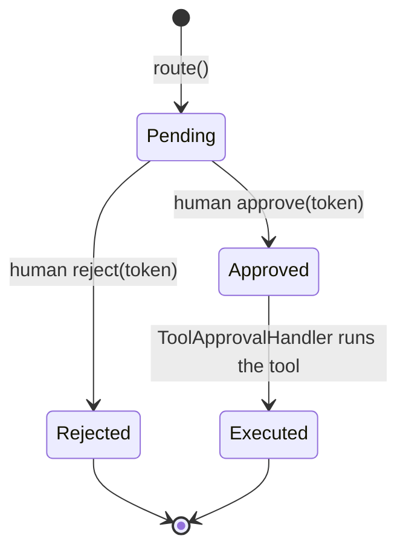

# Human-in-the-loop approvals

Control D routes destructive tool calls through `laravel-flow`'s `approvalGate()`. Two commands make setup turnkey and verifiable.

## Install

::: steps

1. **Require laravel-flow**

   ```bash
   composer require padosoft/laravel-flow
   ```

2. **Create the flow tables**

   ```bash
   php artisan ai-guardrails:hitl-install
   ```

   Runs laravel-flow's migrations scoped straight from vendor (no `vendor:publish`, no unrelated host migrations, idempotent).

3. **Enable + persist**

   ```dotenv
   LARAVEL_FLOW_PERSISTENCE_ENABLED=true
   AI_GUARDRAILS_HITL_ENABLED=true
   ```

4. **Verify**

   ```bash
   php artisan ai-guardrails:hitl-status
   ```

   Exits non-zero with targeted guidance until HITL can actually gate a call.

:::

## Route a destructive tool

```php
use Padosoft\AiGuardrails\Facades\AiGuardrails;

$gated = AiGuardrails::routeForApproval($refundTool, 'refund');
// destructive calls are parked; the model gets a non-secret run reference, not the token.
```

A tool is "destructive" if its name matches `hitl.destructive_tools` under the `destructive_match` policy.

## The approval lifecycle



Pending approvals and the approve/reject actions are exposed by `GET /approvals` and `POST /approvals/{token}/approve|reject` in the [admin API](/operations/http-api) — the decision actor is derived **server-side**, never trusted from the client.

To show an operator *what* they are approving, each pending item also carries the `tool`, the scoped `arguments`, and relative `requested_ago` / `expires_in` times. These come from an append-only **sidecar** (`hitl_requests` store, default-OFF) the bridge writes at park-time — the flow payload alone does not expose them. Set `AI_GUARDRAILS_HITL_REQUESTS_STORE=database` (and run the published migration) to populate them; the write is best-effort and never blocks a parked call.

## Diagnostics

`ai-guardrails:hitl-status` reports each prerequisite:

| Check | Meaning |
|---|---|
| laravel-flow installed | the package is present |
| flow persistence enabled | `laravel-flow.persistence.enabled` |
| `flow_runs` / `flow_approvals` tables | migrations ran |
| master + `hitl.enabled` | the bridge is on |

::: callout warning
- Keep HITL on `enforce` in production — in `monitor` mode destructive calls execute (with a log).
- Restrict `hitl.allowed_tool_classes` to the destructive tool FQCNs to limit blast radius if the flow persistence layer is ever compromised.
:::
