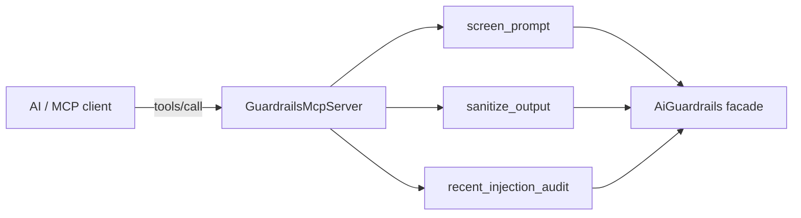

# The MCP surface

A fourth surface (after PHP, Artisan, HTTP API): expose the guardrails to AI clients through the Model Context Protocol via `laravel/mcp`. **Default-OFF.**

## Enable

::: steps

1. **Install laravel/mcp**

   ```bash
   composer require laravel/mcp
   ```

2. **Turn it on**

   ```dotenv
   AI_GUARDRAILS_MCP_ENABLED=true
   ```

3. **Start the local server**

   ```bash
   php artisan mcp:start ai-guardrails
   ```

:::

When `mcp.enabled` is true and `laravel/mcp` is installed, the provider registers a local (stdio) server under the handle `ai-guardrails`. When the package is absent the registration gracefully no-ops.

## The tools

| Tool | Does |
|---|---|
| `screen_prompt` | screen a prompt (Control B) → `{ blocked, rule_id, ruleset_version?, message? }` |
| `sanitize_output` | sanitize an untrusted text blob (Control C) → `{ text }` |
| `recent_injection_audit` | list recent audit attempts (read-only) |



## External-surface hardening

The MCP tools are treated as an externally-reachable surface:

- **Input is length-capped** (`sanitize_output` rejects oversized payloads) to prevent CPU/memory amplification.
- **`ruleset_version` is withheld on benign screens** — exposing it on every call would let an adversarial client fingerprint the active ruleset.
- **`principal_id` is omitted from the audit tool by default**, opt-in via `include_principal_ids`, so internal user identifiers aren't leaked.

::: callout tip
The `Laravel\Mcp\*` reference is confined to `src/Mcp` (architecture test). Mount the server however your host runs MCP — `laravel/mcp` provides the transport; this package provides the tools.
:::
