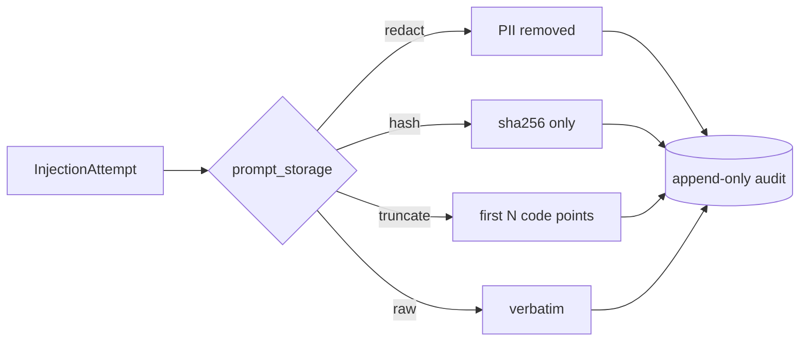

# Audit hygiene & GDPR retention

The append-only audit is the product — but it captures raw prompts, which can contain PII or secrets. Two mechanisms reconcile "immutable forensic record" with "data hygiene + right to erasure".

## Hygiene: transform on write

`audit_hygiene.prompt_storage` chooses how the prompt is transformed **before** it is persisted:

| Mode | Effect |
|---|---|
| `redact` (default) | compose `laravel-pii-redactor` to strip detected PII |
| `hash` | store only `sha256:…` — identical prompts still correlate, no content kept |
| `truncate` | keep the first `truncate_at` Unicode code points |
| `raw` | store verbatim |

Hygiene is applied at the **store boundary**, so every append path (middleware *and* the `ai-guardrails:screen` command) is covered. When the prompt is transformed, the byte-offset matched-span is dropped (it no longer aligns). An unrecognised mode fails safe to `redact` — never `raw`.



## Retention: the one erasure path

The audit models throw on UPDATE/DELETE, so erasure goes through the sanctioned, **actor-audited** `ai-guardrails:purge` command — the only place rows leave the table:

```bash
# Anonymize rows older than the retention window (null prompt + principal), keep the counts:
php artisan ai-guardrails:purge --strategy=anonymize --days=365 --actor="ops:nightly"

# Or hard-delete:
php artisan ai-guardrails:purge --strategy=purge --days=365 --actor="ops:nightly"

# Preview without changing anything:
php artisan ai-guardrails:purge --dry-run
```

| Strategy | Effect |
|---|---|
| `keep` | retain indefinitely (no-op) |
| `anonymize` | null the prompt + principal of rows older than `retention.days` |
| `purge` | hard-delete rows older than `retention.days` |

The command uses the **raw query builder** to bypass the immutable model — keeping the append-only invariant true for every other code path. A mutating run requires `--actor` and `--days >= 1`, requires `audit.store=database`, and logs the actor, strategy, cutoff, and affected-row count.

::: callout warning
- `--actor` is **mandatory** for a mutating run (omit only with `--dry-run`) — erasure must be accountable.
- `--days=0` is rejected for a mutating run (its cutoff would match every row). Use `--dry-run` to preview a days-0 count.
- Schedule it (e.g. a nightly cron) with a fixed `--actor` like `scheduler` so every run is attributable.
:::
