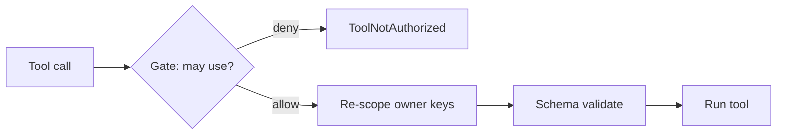

# Guarding & authorizing tools

## Guard a tool (Control A)

```php
use Padosoft\AiGuardrails\Facades\AiGuardrails;

$safe = AiGuardrails::guard($refundTool);
// owner keys re-scoped to the principal + arguments validated against the schema.
```

You can pass a custom principal resolver as the second argument; by default it uses `auth()->guard()->id()`.

## Add the authorization gate (Control A+)

Owner-key re-scoping stops the model acting on **another** user's resource. It does **not** decide whether the principal may use the tool **at all**. Enable `tool_authorization.enabled` and define a Laravel Gate ability:

```php
use Illuminate\Support\Facades\Gate;

Gate::define('ai-guardrails:use-tool', fn ($user, string $toolClass) => $user->mayUse($toolClass));
```

`guard()` then composes **authorize → re-scope → validate → run**; a denial throws `ToolNotAuthorized`.



## Fails closed

The gate denies on an **undefined ability**, an **unauthenticated** user, or a **throwing** policy — every uncertainty is a denial, and each is logged.

| Config | Default | Purpose |
|---|---|---|
| `tool_authorization.enabled` | `false` | turn the gate on |
| `tool_authorization.ability` | `ai-guardrails:use-tool` | the Gate ability checked with the tool class |
| `tool_authorization.owner_key_depth` | `recursive` | re-scope owner keys at any depth |
| `tool_authorization.destructive_match` | `exact` | how destructive tool names are matched |

## Record firewall rejections

Point `firewall_log.store` at `database` and every rejected tool call is appended (tool, principal, violations, timestamp) — surfaced by `GET /firewall` in the [admin API](/operations/http-api).

::: callout warning
Enabling `tool_authorization.enabled` makes the gate **fail-closed** — if you don't define the ability, every guarded tool is denied. Define the Gate before turning it on.
:::
