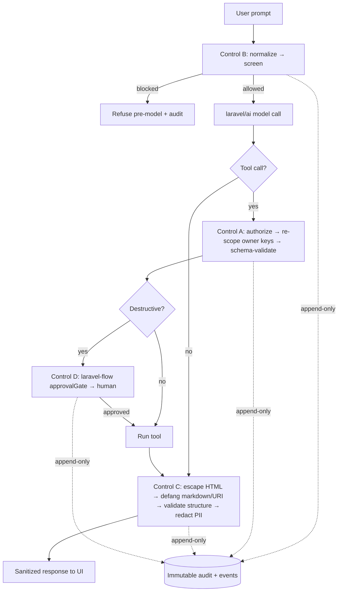

# laravel-ai-guardrails


> **laravel-ai-guardrails treats everything the model touches — its tool arguments, its prompts, and its output — as untrusted.**
> Four deterministic, offline, unit-testable controls screen the prompt before the model runs, re-scope
> tool arguments to the real principal, sanitize the response, and gate destructive actions behind a human.
> No second LLM call, no network, no non-determinism — the append-only audit trail is the product, not a regex you have to trust.

::: callout info "New here? Read this page top to bottom" icon:compass
In five minutes you'll know exactly what this package is, the attack surface it closes, why it beats every
"ask another model to check" alternative, and where to click next. Every other page goes deeper — this one
gives you the whole picture.
:::

---

## What it is — in one minute

`laravel/ai` makes it trivial to give a model **tools** — refund an order, delete a record, send an email —
and to feed it **untrusted user input**. That is exactly where prompt injection lives: the model can be
talked into calling a tool with **someone else's** `user_id`, coaxed into ignoring its instructions, made to
emit stored-XSS or data-exfiltration links in its output, or decide on its own to pull the trigger on a
destructive action.

`laravel-ai-guardrails` closes that gap with **four deterministic, offline, unit-testable controls** that
each treat a different surface as hostile:

- **Screen the prompt before the model runs** — normalize away homoglyph / zero-width / case evasion, match
  against your rules, **refuse pre-model**, and append-only-log every attempt (blocked *and* allowed).
- **Re-scope tool arguments server-side** — the model can never choose another principal's `user_id`; every
  argument is validated against the tool's own JSON schema, unknown args rejected.
- **Sanitize the output** — escape HTML, defang markdown link/image exfil vectors, validate structured
  fields, redact PII before the response ever reaches your UI.
- **Gate destructive calls behind a human** — route refund/delete/email through `laravel-flow`'s
  `approvalGate()` so a person approves before the action runs.

Every failure path **fails closed**: a PCRE error, a tampered flow record, an unresolved engine — every one
blocks rather than silently allows.

> **In one line:** *the deterministic guardrail layer `laravel/ai` is missing — screen, re-scope, sanitize
> and human-gate every untrusted surface, offline and fully audited, from inside your own Laravel app.*

---

## The problem it solves

Giving a model tools and a user's text in the same request is a confused-deputy machine. Here is the gap
this package closes.

| Without laravel-ai-guardrails | With laravel-ai-guardrails |
|---|---|
| The model can be talked into calling a tool with **someone else's** `user_id` (confused-deputy / IDOR). | **Control A** re-scopes owner keys to the authenticated principal **server-side** and validates every argument against the tool schema. |
| A crafted prompt makes the model **ignore its instructions** or exfiltrate secrets. | **Control B** normalizes the prompt, screens it, and **refuses before the model ever runs** — no tokens spent on an attack. |
| Homoglyph / zero-width / case tricks slip a banned phrase past a naïve `str_contains`. | NFKC + zero-width strip + casefold + a curated confusables fold **before** matching defeats the common evasion classes. |
| Model output rendered in your UI carries **stored-XSS, markdown exfil links, or leaked PII**. | **Control C** escapes HTML, defangs markdown/URI vectors, validates structured fields, and redacts PII. |
| The model decides **on its own** to refund, delete or email — and it just happens. | **Control D** routes destructive tool calls through `laravel-flow`'s `approvalGate()` — a human approves first. |
| "We added a guardrail" means a regex nobody can prove catches anything. | An **append-only audit** logs every attempt (blocked and allowed); **mutation testing (MSI ≥ 80)** proves the tests catch regressions. |
| A second LLM "judge" adds latency, cost, network, and its own non-determinism. | Controls A–C **never call a model** — every decision is reproducible, offline and unit-testable. |
| A guardrail that errors out **fails open** and waves the attack through. | Every failure path **fails closed**; a master kill-switch degrades the whole package to pass-through on purpose. |

---

## Who it's for

::: grids
  ::: grid
    ::: card "Teams shipping laravel/ai tools" icon:rocket
    Already giving a model tools and user input? Wrap a tool with `guard()` and add the input/output middleware — owner-key re-scoping, schema validation, screening and sanitization apply with no per-tool wiring.
    :::
  :::
  ::: grid
    ::: card "Security & platform engineering" icon:shield-check
    A deterministic, offline, fail-closed control plane with an append-only audit, enforce/monitor/off modes for safe rollout, and domain events that wire straight into SIEM, Slack or PagerDuty.
    :::
  :::
  ::: grid
    ::: card "Agentic systems with destructive tools" icon:workflow
    Refund, delete and email tools gated behind a human via `laravel-flow` — the model can park a destructive call, but only a person pulls the trigger.
    :::
  :::
  ::: grid
    ::: card "Compliance & data-protection owners" icon:scale
    Raw-prompt hygiene (`redact` / `hash` / `truncate` / `raw`), a sanctioned actor-audited GDPR purge command, and immutable change logs on every security setting.
    :::
  :::
:::

---

## Why it's different — the moats

Most "guardrails" either call a second model to grade the first, or hide a regex you have to trust. This
package is deterministic, offline, fail-closed, and audits everything — and it covers **every** surface the
model touches, not just the prompt.

::: grids
  ::: grid
    ::: card "Untrusted-input posture, everywhere" icon:shield-alert
    Tool arguments, prompts **and** model output are all treated as hostile. Most tools guard one surface; the confused-deputy and output-exfil paths are just as dangerous, and they're covered too.
    :::
  :::
  ::: grid
    ::: card "Deterministic & offline" icon:cpu
    Controls A–C never call a model and never hit the network — every decision is reproducible, fast, free and unit-testable. No second-LLM latency, cost, or non-determinism.
    :::
  :::
  ::: grid
    ::: card "Fails closed, always" icon:lock
    A PCRE error, a tampered flow record, an unresolved engine, an undefined Gate ability — every failure path **blocks** rather than silently allowing. Fail-open is treated as a bug, not a fallback.
    :::
  :::
  ::: grid
    ::: card "The append-only audit is the product" icon:scroll-text
    Every screening attempt — blocked *and* allowed — is appended to an immutable store. The model + query builder **throw on update / delete / upsert / truncate**; the table has no `updated_at`.
    :::
  :::
  ::: grid
    ::: card "Owner-key re-scoping ≠ authorization" icon:key-round
    Re-scoping stops the model acting on **another** user's resource; an optional Gate layer (`authorize → re-scope → validate → run`) decides whether the principal may use the tool **at all** — both fail closed.
    :::
  :::
  ::: grid
    ::: card "Evasion-resistant normalization" icon:scan-search
    NFKC, zero-width strip, casefold and a curated cross-script **confusables fold** (Cyrillic / Greek look-alikes → Latin skeleton) run **before** matching, defeating homoglyph / zero-width / case evasion.
    :::
  :::
  ::: grid
    ::: card "Enforce / monitor / off — safe rollout" icon:toggle-right
    `monitor` mode detects, audits and emits an event **without blocking** — shadow-deploy a new ruleset in production, watch what it *would* have done, then flip to `enforce`.
    :::
  :::
  ::: grid
    ::: card "Composes, doesn't reinvent" icon:blocks
    Optional `laravel-flow` (approvals), `laravel-pii-redactor` (PII), `HTMLPurifier` (robust HTML) and `laravel/mcp` — each guarded by `class_exists`, null-object-bound when absent, confined to its own dir by an architecture test.
    :::
  :::
  ::: grid
    ::: card "Four surfaces, one engine" icon:layers
    The same controls are reachable from a **PHP facade**, **Artisan** commands, a default-OFF **HTTP admin API** (versioned `{schema_version, schema, data}` envelope) and an **MCP** server — pick the surface, the decision is identical.
    :::
  :::
:::

---

## See it: the admin control plane

A React control plane ships separately as **`laravel-ai-guardrails-admin`** — driving this package's HTTP
API for the audit trail, firewall posture, output stats and the approval queue. It consumes the
default-OFF `ai-guardrails.api.*` endpoints directly.


---

## laravel-ai-guardrails vs. the alternatives

| Capability | **laravel-ai-guardrails** | DIY regex | LLM-as-judge guardrail | Output-only sanitizer |
|---|:---:|:---:|:---:|:---:|
| Screens the prompt **before** the model runs | ✅ | ➖ | ❌ | ❌ |
| Deterministic & offline (no second model, no network) | ✅ | ✅ | ❌ | ✅ |
| Owner-key re-scoping (confused-deputy / IDOR) | ✅ | ❌ | ❌ | ❌ |
| Output sanitization (HTML / markdown exfil / PII) | ✅ | ❌ | ➖ | ✅ |
| Human-in-the-loop gate on destructive tools | ✅ | ❌ | ❌ | ❌ |
| Evasion-resistant normalization (homoglyph / zero-width) | ✅ | ❌ | ➖ | ❌ |
| Append-only audit of every attempt | ✅ | ❌ | ➖ | ❌ |
| Fails **closed** on every error path | ✅ | ➖ | ❌ | ➖ |
| Enforce / monitor / off shadow-rollout modes | ✅ | ❌ | ❌ | ❌ |
| Self-hosted in **your** Laravel DB, you own the data | ✅ | ✅ | ❌ | ✅ |

> Legend: ✅ built-in · ➖ partial / DIY / not exposed · ❌ not available.

---

## How it fits together

A request flows through the input middleware (screen → refuse → audit), then the guarded tools
(authorize → re-scope → validate → run, with destructive calls parked for a human), then the output
middleware (sanitize → redact). Every decision writes to an append-only store and emits a domain event from
the same code path.



Every screening attempt is partitioned by the audit invariant:

$$
total = blocked + allowed, \qquad observed \subseteq allowed
$$

where `observed` is a monitor-mode detection that was *not* blocked.

---

## Start in 30 seconds

::: steps
1. **Install the package**
   ```bash
   composer require padosoft/laravel-ai-guardrails
   php artisan vendor:publish --tag=ai-guardrails-config
   ```
   The four controls are **on by default** — that is the point. Optional: publish + migrate the audit
   table (`--tag=ai-guardrails-migrations`) and set `AI_GUARDRAILS_AUDIT_STORE=database` for a
   database-backed audit.

2. **Guard a tool call** (Control A — re-scope owner keys + validate args)
   ```php
   use Padosoft\AiGuardrails\Facades\AiGuardrails;

   $safeTool = AiGuardrails::guard($refundTool);
   // The model can no longer choose another user's user_id; unknown args are rejected.
   ```

3. **Screen a prompt or sanitize output** anywhere
   ```php
   $verdict = AiGuardrails::screen($userPrompt);     // ->blocked, ->ruleId, ->refusalMessage
   $clean   = AiGuardrails::sanitize($modelOutput);  // HTML/markdown sanitized + PII redacted
   ```
   Or declare `GuardrailInputMiddleware` + `GuardrailOutputMiddleware` on your agent to screen and
   sanitize **automatically** — the input middleware refuses without ever invoking the model.
:::

**[→ Quickstart](/quickstart)** · **[→ Installation](/installation)** · **[→ The four controls](/controls/overview)**

---

## Batteries included for AI-assisted development

This repo ships **AI batteries** — a `CLAUDE.md` working guide, an `AGENTS.md` workflow contract and
invocable `.claude/skills/` encoding the TDD loop, the untrusted-input security posture and the
docs-sync discipline. Open the package in Claude Code, Cursor, Copilot or Codex and your agent already
knows the house rules.

---

## Where to go next

::: grids
  ::: grid
    ::: card "Quickstart" icon:zap
    Install, guard your first tool and screen a prompt in five steps. **[Open →](/quickstart)**
    :::
  :::
  ::: grid
    ::: card "Threat model & theory" icon:brain
    The untrusted-input posture, the attack classes each control closes, and why deterministic beats LLM-as-judge. **[Read →](/concepts/threat-model)**
    :::
  :::
  ::: grid
    ::: card "Architecture" icon:boxes
    The request pipeline, compose-not-couple boundaries, and the ADRs behind the design. **[Explore →](/architecture/overview)**
    :::
  :::
:::

::: callout tip "Package facts" icon:info
Composer `padosoft/laravel-ai-guardrails` · PHP `^8.3` · Laravel `13.x` · PHPStan level 8 · Apache-2.0 ·
[GitHub](https://github.com/padosoft/laravel-ai-guardrails) · [Packagist](https://packagist.org/packages/padosoft/laravel-ai-guardrails)
:::
