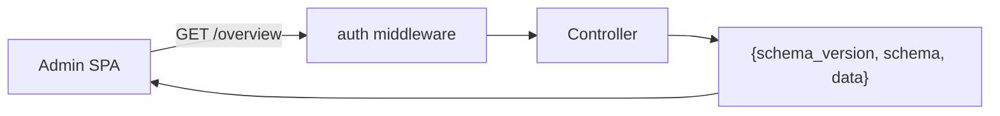

# The HTTP admin API

A read/config HTTP API for an admin panel (e.g. `laravel-ai-guardrails-admin`). It is **default-OFF**.

## Turn it on — safely

```php
// config/ai-guardrails.php
'api' => [
    'enabled'    => true,
    'prefix'     => 'ai-guardrails/api',
    'middleware' => ['auth:sanctum'], // YOU must supply auth — these endpoints expose audit data
],
```

::: callout danger
If `api.enabled` is true but `api.middleware` resolves to an empty list, the service provider **throws at boot** — fail-closed against an accidentally open surface. It does **not** inspect what your middleware does: you must include your own authentication/authorization.
:::

## The envelope

Every response is `{ "schema_version": "ai-guardrails.api.v1", "schema": "ai-guardrails.api.v1.<endpoint>", "data": { … } }`. `schema_version` is the contract a client pins; `schema` is a per-endpoint discriminator. Routes are named `ai-guardrails.api.*`.



## Endpoints

| Method | Path | Returns |
|---|---|---|
| GET | `/overview` | per-control `enabled` + effective `mode` + 24h counts + active `ruleset_version` |
| GET | `/audit` | keyset-paginated audit list (filters `blocked`/`rule_id`/`principal_id`/`q`/`from`/`to`) |
| GET | `/audit/{id}` | full prompt + matched span |
| GET | `/audit/trend` | per-UTC-day counts (dialect-safe SQL) |
| GET | `/firewall` | Control A rejections, keyset-paginated |
| GET | `/output/stats` | per-kind output-sanitization counts |
| GET | `/approvals` | pending HITL approvals — each item carries `tool`, scoped `arguments`, `requested_ago`, `expires_in` |
| POST | `/approvals/{token}/approve\|reject` | resume/reject a parked tool (actor derived server-side) |
| GET | `/settings` | effective overridable settings |
| PUT | `/settings` | persist allow-listed, type-validated overrides; appends a change record |
| GET | `/settings/changes` | append-only WHO/WHAT change log |
| POST | `/try/screen`, `/try/sanitize` | sandbox a prompt / text blob (no persistence) |

## Untrusted query params

The list endpoints treat every query param as untrusted: keyset cursors are parsed as strictly-positive integers, `LIKE` metacharacters are escaped, dates are strict ISO-8601, repeated array params are ignored rather than 500-ing, and stored text is `mb_scrub`-bed before JSON encoding.

---

## GET /overview — v1.1.0 additions

The `/overview` response adds the following fields (backward-compatible — v1.0 fields are unchanged):

### `controls[].posture` (string)

Human-readable posture label derived from the control's effective mode and enabled state:

| Value | When |
|---|---|
| `"Engaged"` | mode = `enforce`, control enabled |
| `"Observing"` | mode = `monitor` |
| `"Disabled"` | mode = `off` **or** control disabled |

### `controls[].spark` (int[12])

Twelve-bucket hourly histogram for the trailing 12 hours. Bucket 11 = current UTC hour, bucket 0 = 11 hours ago. All values are non-negative integers.

::: callout info
The injection audit store does not attribute attempts to a specific control, so **every control shares the same trailing-12h sparkline** (derived from all injection attempts). All four controls will show identical spark arrays until per-control attribution is wired in a future release.
:::

### `totals.observed_24h` (int)

Count of injection attempts in the last 24 hours where `blocked = false` AND `rule_id IS NOT NULL` — i.e. monitor-mode observations (rule matched but not blocked). Complements the existing `blocked_24h` counter.

### `totals.pending_approvals` (int)

Count of currently pending HITL approvals (requires `laravel-flow`). Returns `0` when HITL is unavailable.

::: callout info
All four fields were added in **v1.1.0** and are backward-compatible. Clients that do not yet use them can safely ignore them.
:::

---

## GET /audit/trend — v1.1.0 additions

Each point in `data.points[]` now carries an `observed` bucket alongside the existing `date`, `total`, `blocked`, and `allowed` fields.

### `points[].observed` (int)

Count of attempts on that day where `blocked = false` AND `rule_id IS NOT NULL` — monitor-mode matches that were detected but not blocked.

### Three-way invariant

For every point: **`total === blocked + observed + allowed`**. This invariant holds for all rows including the degenerate case `blocked = true, rule_id = null` (which counts as `blocked` only, never as `allowed`).

| Bucket | Condition |
|---|---|
| `blocked` | `blocked = true` |
| `observed` | `blocked = false` AND `rule_id IS NOT NULL` |
| `allowed` | `blocked = false` AND `rule_id IS NULL` |

::: callout info
`observed` was added in **v1.1.0**. The `date`, `total`, `blocked`, and `allowed` fields are unchanged. All existing clients remain compatible.
:::

---

## GET /output/stats — v1.1.0 additions

### `counts.pii.by_detector` (object — string keys to int values)

Breaks down `counts.pii_redaction` by the detector that fired. Keys are detector names (e.g. `"email"`, `"phone"`, `"ssn"`); values are the summed redaction counts for that detector. When no per-detector data exists (e.g. the store has no PII rows, or they were recorded without a detector tag), the field is an empty object `{}`.

This field is additive — `counts.pii_redaction` (the total) is unchanged.

```json
{
  "counts": {
    "html_stripped": 2,
    "markdown_sanitized": 0,
    "structured_validation_failure": 0,
    "pii_redaction": 5,
    "pii": {
      "by_detector": { "email": 3, "phone": 2 }
    }
  },
  "total": 7
}
```

::: callout info
`pii.by_detector` was added in **v1.1.0**. The existing `counts.*` keys and `total` are unchanged.
:::

---

## GET /approvals — v1.1.0 additions

Each `pending[]` item now carries four enrichment fields in addition to the base flow fields (`approval_id`, `run_id`, `step_name`, `status`, `expires_at`, `created_at`):

| Field | Type | Description |
|---|---|---|
| `tool` | `string` | The tool name that was parked for approval (e.g. `"refund"`). Empty string `""` when no sidecar row exists for this `run_id`. |
| `arguments` | `object` | The **scoped** arguments as rewritten by Control A (owner keys already overwritten, unknown keys already stripped). Empty object `{}` when no sidecar row exists. |
| `requested_ago` | `string` | Human-readable relative time since `created_at` (e.g. `"2 minutes ago"`). |
| `expires_in` | `string\|null` | Human-readable relative time until `expires_at`, or `null` when the approval has no expiry. |

### Raw arguments — by design

The `arguments` field exposes the **scoped** tool arguments verbatim. This is intentional: an approver must see exactly what will execute when they approve. The sidecar (`ai_guardrails_hitl_requests`) is append-only and covered by `ai-guardrails:purge` for GDPR erasure — see [audit hygiene & retention](/guides/retention).

### Sidecar availability

The sidecar is **default-OFF** (`hitl_requests.store = null`). Enable `array` or `database` to populate `tool`/`arguments`. When no sidecar row exists for a `run_id`, the item degrades gracefully: `tool: ""`, `arguments: {}`. The sidecar write is **best-effort** — a logging failure never un-parks or errors an already-parked approval.

::: callout info
`tool`, `arguments`, `requested_ago`, and `expires_in` were added in **v1.1.0** and are backward-compatible. The base flow fields are unchanged.
:::

---

## Overridable settings

`PUT /settings` only accepts keys on the `settings.overridable` allow-list, each strictly type-validated as **untrusted input** — a malformed value rejects the whole request (422); a non-overridable key is silently dropped (forward-compatible). `GET /settings` returns the effective value (file default overlaid with any DB override) for every allow-listed key.

| Key | Validation |
| --- | --- |
| `tool_firewall.enabled`, `tool_firewall.reject_unknown_arguments`, `input_screen.enabled`, `output_handler.enabled`, `output_handler.sanitize_html`, `output_handler.neutralize_markdown`, `output_handler.redact_pii`, `hitl.enabled`, `normalization.enabled`, `normalization.nfkc`, `normalization.strip_zero_width`, `normalization.casefold`, `normalization.decode_base64_blobs`, `normalization.fold_confusables`, `tool_authorization.enabled` | boolean (`true`/`false`/`1`/`0`) |
| `tool_firewall.owner_keys`, `hitl.destructive_tools` | array of non-empty strings |
| `input_screen.patterns` | map `rule_id => regex`; **each pattern must be a fully-delimited PCRE string** (e.g. `/\bdrop\b/iu`) — the `/u` flag is required and the pattern must compile; a bad regex rejects the whole request (never stored) |
| `input_screen.refusal_message` | UTF-8 string (≤ 2000 chars) |
| `normalization.max_prompt_length` | integer `> 0` |
| `retention.days` | integer `>= 0` |
| `retention.strategy` | `anonymize` \| `purge` \| `keep` |
| `output_handler.html_mode` | `escape` \| `allowlist` |
| `hitl.fallback` | `deny` \| `pass` |
| `modes.tool_firewall`, `modes.input_screen`, `modes.output_handler`, `modes.hitl` | `enforce` \| `monitor` \| `off` |
| `pattern_safety.on_match_error` | `closed` \| `open` |
| `tool_authorization.owner_key_depth` | `top_level` \| `recursive` |
| `tool_authorization.destructive_match` | `exact` \| `substring` |
| `audit_hygiene.prompt_storage` | `redact` \| `hash` \| `truncate` \| `raw` |

### Read-only (infra) keys

The following keys are **not** overridable at runtime — they are config/env-only and are silently dropped from a `PUT` body:

- `audit.store`, `audit.table`, `audit.connection`
- `firewall_log.store`, `firewall_log.table`, `firewall_log.connection`
- `output_stats.store`, `output_stats.table`, `output_stats.connection`
- `settings.store`, `settings.table`, `settings.connection`
- `settings_audit.store`, `settings_audit.table`, `settings_audit.connection`
- `hitl_requests.store`, `hitl_requests.table`, `hitl_requests.connection`

These keys affect database routing and must be set via environment variables — changing them at runtime could corrupt data or split the audit trail across stores.

::: callout info
The allow-list was widened in **v1.1.0** to include the per-key `normalization.*` sub-toggles (`nfkc`, `strip_zero_width`, `casefold`, `decode_base64_blobs`, `fold_confusables`, `max_prompt_length`) and `hitl.destructive_tools`. All new keys are backward-compatible — a `PUT` with only old keys ignores the new ones.
:::

## Settings audit

`PUT /settings` records every **effective** change (before ≠ after) to the `settings_audit` store with the **server-derived** actor (never client-supplied) and dispatches `SettingsChanged`. `GET /settings/changes` lists them.

::: callout info
The admin SPA is a separate package (`laravel-ai-guardrails-admin`). This API is the contract it consumes; the envelope + route names are stable within `…api.v1`.
:::
