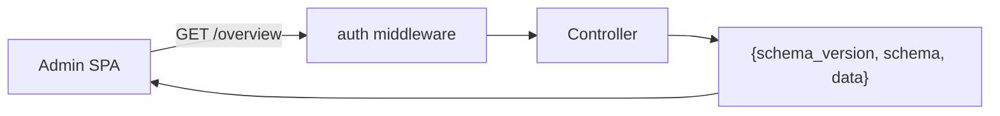

# The HTTP admin API

A read/config HTTP API for an admin panel (e.g. `laravel-ai-guardrails-admin`). It is **default-OFF**.

## Turn it on — safely

```php
// config/ai-guardrails.php
'api' => [
    'enabled'    => true,
    'prefix'     => 'ai-guardrails/api',
    'middleware' => ['auth:sanctum'], // YOU must supply auth — these endpoints expose audit data
],
```

::: callout danger
If `api.enabled` is true but `api.middleware` resolves to an empty list, the service provider **throws at boot** — fail-closed against an accidentally open surface. It does **not** inspect what your middleware does: you must include your own authentication/authorization.
:::

## The envelope

Every response is `{ "schema_version": "ai-guardrails.api.v1", "schema": "ai-guardrails.api.v1.<endpoint>", "data": { … } }`. `schema_version` is the contract a client pins; `schema` is a per-endpoint discriminator. Routes are named `ai-guardrails.api.*`.



## Endpoints

| Method | Path | Returns |
|---|---|---|
| GET | `/overview` | per-control `enabled` + effective `mode` + 24h counts + active `ruleset_version` |
| GET | `/audit` | keyset-paginated audit list (filters `blocked`/`rule_id`/`principal_id`/`q`/`from`/`to`) |
| GET | `/audit/{id}` | full prompt + matched span |
| GET | `/audit/trend` | per-UTC-day counts (dialect-safe SQL) |
| GET | `/firewall` | Control A rejections, keyset-paginated |
| GET | `/output/stats` | per-kind output-sanitization counts |
| GET | `/approvals` | pending HITL approvals — each item carries `tool`, scoped `arguments`, `requested_ago`, `expires_in` |
| POST | `/approvals/{token}/approve\|reject` | resume/reject a parked tool (actor derived server-side) |
| GET | `/settings` | effective overridable settings |
| PUT | `/settings` | persist allow-listed, type-validated overrides; appends a change record |
| GET | `/settings/changes` | append-only WHO/WHAT change log |
| POST | `/try/screen`, `/try/sanitize` | sandbox a prompt / text blob (no persistence) |

## Untrusted query params

The list endpoints treat every query param as untrusted: keyset cursors are parsed as strictly-positive integers, `LIKE` metacharacters are escaped, dates are strict ISO-8601, repeated array params are ignored rather than 500-ing, and stored text is `mb_scrub`-bed before JSON encoding.

## Approvals: tool, arguments and relative times

Each `pending[]` item from `GET /approvals` carries the base fields `{approval_id, run_id, step_name, status, expires_at, created_at}` plus four enrichments: `tool` (the tool name), `arguments` (the **scoped** arguments as re-written by Control A), `requested_ago` (a relative human string from `created_at`), and `expires_in` (relative to `expires_at`, or `null` when the approval has no expiry).

The underlying flow approval payload does **not** carry the tool name or arguments — they live in `flow_runs.input` and are not exposed by the read path. So the bridge persists them itself: at park-time `ApprovalGatedTool` appends one row to an **append-only sidecar** (`hitl_requests` store), and `GET /approvals` batch-joins it on `run_id`. The sidecar write is **best-effort** — a logging failure never un-parks or errors an already-parked approval.

::: callout info
The sidecar is **default-OFF** (`hitl_requests.store = null`). Enable `array` or `database` to populate `tool`/`arguments`; when no sidecar row exists for a `run_id`, the item degrades gracefully to `tool: ""` and `arguments: {}`.
:::

## Settings audit

`PUT /settings` records every **effective** change (before ≠ after) to the `settings_audit` store with the **server-derived** actor (never client-supplied) and dispatches `SettingsChanged`. `GET /settings/changes` lists them.

::: callout info
The admin SPA is a separate package (`laravel-ai-guardrails-admin`). This API is the contract it consumes; the envelope + route names are stable within `…api.v1`.
:::
