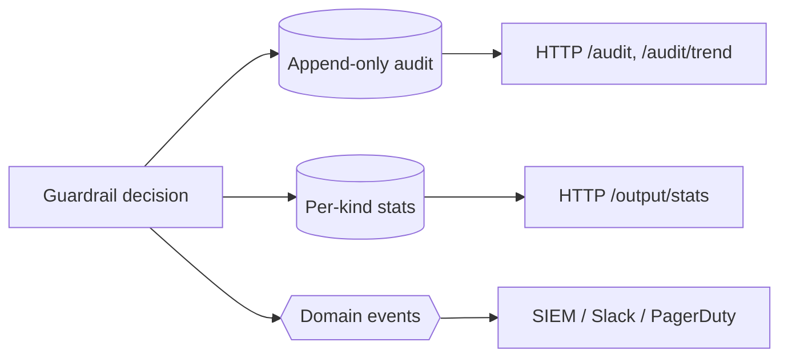

# Observability & mutation testing

## Three observability channels



- **Audit** — every screening attempt, immutable, queryable via `GET /audit` and aggregated by `GET /audit/trend`.
- **Stats** — per-kind output-sanitization counts via `GET /output/stats`.
- **Events** — real-time signals; see the [events guide](/guides/events).

The overview endpoint surfaces each control's resolved `mode` and the active `ruleset_version`, so a dashboard shows shadow-vs-live posture and ruleset drift.

## Mutation testing: proving the tests bite

Green tests prove the code runs; they do **not** prove the tests would *catch* a regression. The package's CI runs **Infection** at **≥ 80% MSI** (Mutation Score Indicator) over the deterministic security logic.

$$
\text{MSI} = \frac{\text{killed} + \text{timed-out} + \text{errored}}{\text{total mutants}} \geq 0.80
$$

A *mutant* is a small change to the source (flip a comparison, swap an enum arm, remove a branch). If the suite still passes with the mutant in place, the mutant **escaped** — a blind spot. The gate fails the build until enough mutants are killed.

## Scope of the gate

Mutation testing targets the **algorithmic** security logic — scoping, validation, screening, normalization, sanitization, mode resolution, hygiene, authorization. The IO/adapter layers (HTTP controllers, console commands, persistence DAOs, the MCP/flow adapters) are excluded: their mutants are response-shaping strings and SQL-dialect arms with low behavioural signal.

## Running it

Infection runs via the standalone **PHAR** with a coverage driver (it cannot be Composer-installed alongside Symfony 8 / Laravel 13). In CI: `shivammathur/setup-php` with `coverage: pcov`, then:

```bash
php infection.phar --min-msi=80 --threads=max --show-mutations
```

::: callout info
PHP 8.5 has no published coverage driver yet (no xdebug 8.5/VS17 build, no Windows pcov binary), so the mutation gate runs **in CI** on PHP 8.4. Locally, PHPUnit + Pint + PHPStan are the gates; mutation is a CI job. Mirror CI with Docker (`php:8.4-cli` + pcov + the Infection PHAR) to run it locally.
:::
