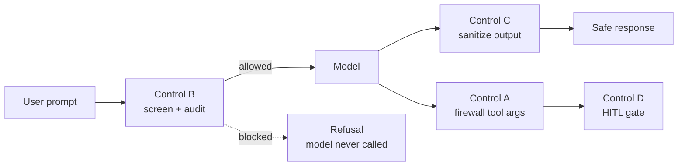

# Quickstart

Junior-proof. Five steps from `composer require` to a guarded agent.

::: steps

1. **Install the package**

   ```bash
   composer require padosoft/laravel-ai-guardrails
   ```

2. **Publish the config**

   ```bash
   php artisan vendor:publish --tag=ai-guardrails-config
   ```

3. **(Optional) Publish + run the audit migration** — only if you want database-backed audit:

   ```bash
   php artisan vendor:publish --tag=ai-guardrails-migrations
   php artisan migrate
   ```

   then set `AI_GUARDRAILS_AUDIT_STORE=database` in your `.env`.

4. **Guard a tool call** (Control A) anywhere in your app:

   ```php
   use Padosoft\AiGuardrails\Facades\AiGuardrails;

   $safeTool = AiGuardrails::guard($refundTool); // re-scopes owner keys + validates args
   ```

5. **Screen a prompt or sanitize output**:

   ```php
   $verdict = AiGuardrails::screen($userPrompt);     // ->blocked, ->ruleId, ->refusalMessage
   $clean   = AiGuardrails::sanitize($modelOutput);  // HTML/markdown sanitized + PII redacted
   ```

:::

That's it. Add the [agent middleware](/guides/middleware) to screen prompts and sanitize output automatically on every agent run.

::: callout info
The four controls are **on by default** — that is the point. The **HITL bridge** (`hitl.enabled`) and the **HTTP API** (`api.enabled`) are default-OFF because they need optional dependencies or an explicit opt-in.
:::

## What you just enabled



## Next steps

::: grids
::: grid
::: card "Understand the controls" icon:lucide-shield
A walkthrough of each defensive layer and the threat it closes.

[The four controls →](/controls/overview)
:::
::: card "Wire the middleware" icon:lucide-plug
Screen prompts and sanitize output automatically on your agents.

[Middleware guide →](/guides/middleware)
:::
:::
:::
