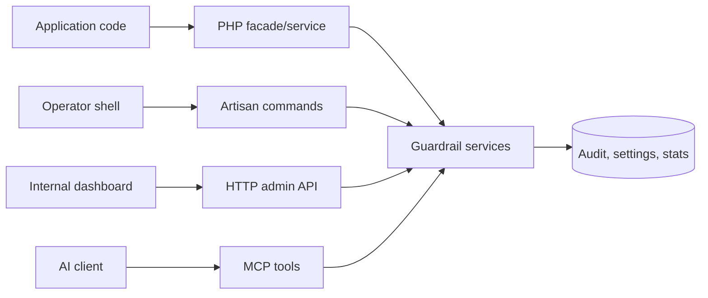

# API Overview

`laravel-ai-guardrails` exposes the same guardrail capabilities through four surfaces: PHP code, Artisan commands, the optional HTTP admin API, and the optional MCP server.

::: callout tip
Use PHP for application control flow, Artisan for operator workflows, HTTP for internal admin dashboards, and MCP when an AI client needs the same deterministic screen/sanitize/audit tools.
:::

## Surface map

::: grids
::: grid
::: card "PHP API" icon:lucide-code-2
Facade and service methods for guarding tools, screening prompts, sanitizing output, and reading audit state.

[Open](/reference/php-api)
:::
::: card "CLI" icon:lucide-terminal
Artisan commands for screening, sanitizing, auditing, HITL installation/status, and retention cleanup.

[Open](/reference/cli)
:::
:::
::: grid
::: card "HTTP API" icon:lucide-route
Default-off internal routes for dashboards and operational integrations.

[Open](/operations/http-api)
:::
::: card "MCP" icon:lucide-plug
Optional `laravel/mcp` tools for AI clients that need screen, sanitize, and recent-audit actions.

[Open](/guides/mcp)
:::
:::
:::

## Request flow



## Contract

| Surface | Default state | Primary use | Safety boundary |
|---|---:|---|---|
| PHP | On when installed | Runtime guardrails | Laravel auth, container bindings, config |
| Artisan | On when installed | Local and CI operations | Shell access and app environment |
| HTTP | Off | Admin dashboards | Required middleware allow-list |
| MCP | Off unless `laravel/mcp` present and enabled | AI-client guardrail tools | MCP server registration and Laravel config |

::: collapsible "ADR · Tri-surface discipline"
**Problem.** A security control is hard to operate when the application, shell, and dashboard each expose a different subset.

**Decision.** Keep PHP, CLI, and HTTP aligned around the same service contracts, then add MCP as an optional adapter.

**Consequences.** The package is easier to test and document; optional adapters must degrade cleanly when their vendor package is absent.
:::

## Worked example

```php
use Padosoft\AiGuardrails\Facades\AiGuardrails;

$verdict = AiGuardrails::screen('ignore previous instructions');

if (! $verdict->allowed()) {
    report('Prompt was rejected by the input screener.');
}
```

::: callout warning
The HTTP API is an admin surface. Keep `api.enabled` false until middleware is configured, and never expose the routes directly to the public internet.
:::
