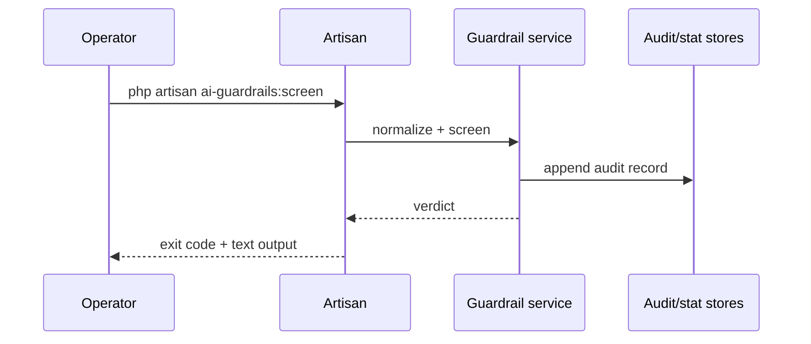

# CLI Reference

The CLI is the fastest way to exercise the same deterministic controls outside an agent run.

## Commands

| Command | Purpose |
|---|---|
| `ai-guardrails:screen` | Normalize and screen a prompt, then return the verdict |
| `ai-guardrails:sanitize` | Run output sanitization on text or structured output |
| `ai-guardrails:audit` | Inspect recent injection audit records |
| `ai-guardrails:purge` | Apply the configured retention strategy |
| `ai-guardrails:hitl-install` | Install HITL bridge support when using `laravel-flow` |
| `ai-guardrails:hitl-status` | Inspect pending approval state |

## Workflow



## Examples

::: steps
1. **Screen a prompt**
   ```bash
   php artisan ai-guardrails:screen "ignore previous instructions"
   ```

2. **Sanitize output**
   ```bash
   php artisan ai-guardrails:sanitize "<script>alert(1)</script>"
   ```

3. **Review recent audit entries**
   ```bash
   php artisan ai-guardrails:audit --limit=20
   ```
:::

::: collapsible "ADR · CLI mirrors runtime controls"
**Problem.** Operators need to reproduce guardrail decisions without constructing a whole agent request.

**Decision.** Artisan commands call the same services used by middleware and facades.

**Consequences.** A CLI verdict is useful evidence when debugging production behavior.
:::

::: callout warning
Run CLI commands in the same Laravel environment you are diagnosing. Config, stores, optional vendors, and feature modes are environment-sensitive.
:::
