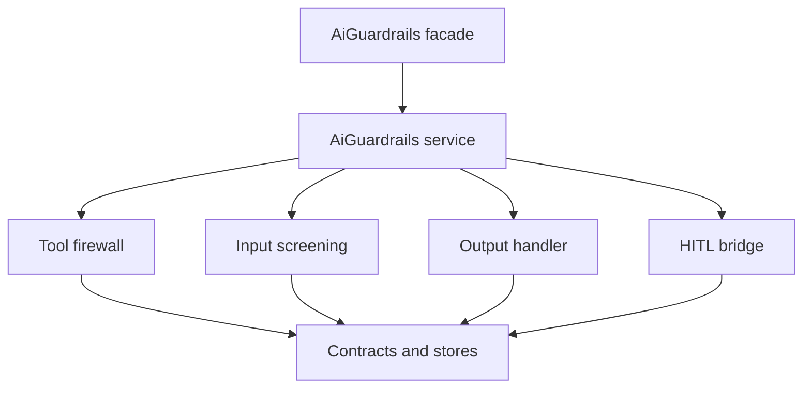

# PHP API

The PHP surface is the primary integration point. It wraps tools, screens prompts, sanitizes output, and reads audit data without adding a second model call.

## Entry points

| Entry point | Use |
|---|---|
| `Padosoft\AiGuardrails\Facades\AiGuardrails` | Facade for common guardrail actions |
| `Padosoft\AiGuardrails\AiGuardrails` | Container-resolved service behind the facade |
| Contracts in `Padosoft\AiGuardrails\Contracts` | Replaceable stores, normalizers, screeners, sanitizers, routers, and validators |

## Typical calls

```php
use Padosoft\AiGuardrails\Facades\AiGuardrails;

$guardedTool = AiGuardrails::guard($tool);
$verdict = AiGuardrails::screen($prompt);
$sanitized = AiGuardrails::sanitize($modelOutput);
```

::: tabs
== tab "Tool firewall"

```php
$guarded = AiGuardrails::guard($refundTool);
$result = $guarded->handle($request);
```

== tab "Input screening"

```php
$verdict = AiGuardrails::screen($prompt);
abort_unless($verdict->allowed(), 422);
```

== tab "Output handler"

```php
$clean = AiGuardrails::sanitize($assistantText);
```
:::

## Contract



The service delegates to contracts so applications can replace storage and policy boundaries without rewriting the controls.

::: collapsible "ADR · Facade over direct constructors"
**Problem.** The package needs a stable user-facing API while individual controls evolve.

**Decision.** Keep public calls on the facade/service and bind lower-level contracts in Laravel's container.

**Consequences.** Application code stays small, and tests can swap stores or validators directly.
:::

::: callout warning
Treat constructor signatures in internal control classes as implementation details. Prefer the facade, service, or documented contracts.
:::
